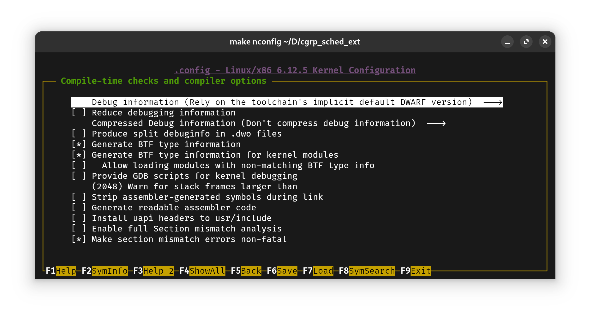

# gdb可以调试libvirt的KVM内核吗？

gdb可以调试几乎你能想到的所有程序，甚至你本机正在运行的内核（要求内核编译时启用了KGDB）。

在调试KVM之前，你一定得知道KVM是和QEMU配合使用而构建的虚拟机，可以通过QEMU的CLI启动，所以要知道怎么调试KVM内核得先知道如何调试QEMU内核。

> QEMU可以纯模拟地直接启用，不需要KVM即可运行许多常见指令集的虚拟机（模拟器）；而KVM则是利用硬件辅助虚拟化来实现的同指令集架构的虚拟机。

> QEMU兼容KVM，可以用`-enable-kvm`参数启用KVM虚拟机

## QEMU虚拟机的内核调试方法

QEMU虚拟机的内核调试需要：

- 自制initramfs（当然如果你要调试内核的启动早期用不到也可以不做）
- 编译带调试信息的内核的bzImage（如图高亮部分所示，这个选项不能选`Disable debug information`）
	<div align=center>
		
	</div>
- 编译内核时关闭内存随机化或传入`nokaslr`参数
- 对QEMU传入`-s`（启用gdb调试，并占用1234号端口用于调试，等价于`-gdb tcp::1234`）和`-S`（在启动时暂停）参数

为此，我准备了一个Makefile，用于制作initramfs和启动带调试功能的QEMU虚拟机：

```bash
initramfs:
	cd ./initramfs && find . -print0 | cpio -ov --null --format=newc | gzip -9 > ../initramfs.img

run:
	qemu-system-x86_64 \
		-kernel bzImage \
		-initrd initramfs.img \
		-m 1G \
		-nographic \
		-enable-kvm \	# 可以直接启用KVM，但这终究只是精简的initramfs，只适合调试启动时的代码
		-append "earlyprintk=serial,ttyS0 console=ttyS0 nokaslr" \
		-s \
		-S

.PHONY: initramfs run
```

`make run`后，让gdb在内核根路径下`gdb -ex "target remote :1234" vmlinux`，这样就可以开始调试QEMU启动的内核了。

> 注：这种调试方法缺少正式的initramfs，是用户自行打包的，会缺少部分模块的执行调用，可能会漏掉bug。

## libvirt的KVM的调试方法

既然KVM需要和QEMU配合使用，那就可以在libvirt的虚拟机xml配置文件中添加QEMU调试参数来启用调试。

```bash
sudo virsh edit schced_ext	# 我要调试的虚拟机叫作sched_ext
```

在第一行`<domain>`标签中加入`xmlns:qemu`部分，并在`<domain>`内部添加QEMU的调试参数即可。

```xml
<domain type='kvm' xmlns:qemu='http://libvirt.org/schemas/domain/qemu/1.0'>
  <!-- 其他配置（如内存、CPU） -->
  <qemu:commandline>
    <qemu:arg value='-s'/>          <!-- 启用 GDB 调试端口（默认 tcp::1234） -->
    <qemu:arg value='-S'/>          <!-- 启动时暂停虚拟机，等待 GDB 连接 -->
  </qemu:commandline>
</domain>
```

> 注：笔者在这里遇到了sudo virsh edit默认编辑器不存在的情况，你可以去安装`vi`或者在`/etc/environment`中加入`EDITOR=/path/to/your/favorite/editor`。

重新启用虚拟机：

```bash
sudo virsh start schced_ext
```

gdb侧的连接过程是完全相同的。

> 注：如果`CONFIG_FRAME_POINTER=y`配置正确，则gdb的调试栈中将会让栈的回溯信息（`bt`）变得更加完整（不会再出现问号开头的gdb回溯栈信息）。

> 另注：gdb一开始的断点可以不要用软件中断(`break`)来设置，而是硬件中断(`hbreak`)。这样即使所需的地址范围初始化还没开始也能正确插入断点。

# 调试内核中的疑难杂症

## 内核kernel oops该怎么debug？

kernel oops是常见的内核地址访问错误，大多数时候这种错误会在内核日志中报错打印出报错时的堆栈信息和出错位置。
这时利用这个出错位置和带调试符号的vmlinux，就可以用这个办法找出错误点：

```bash
addr2line -e vmlinux [address or function signature with offset]
```

但是也有一些情况在内核中断函数中出现的访存错误，此时再次中断并获取一些锁将发生死锁，内核会卡住无法动弹。
这时可以利用gdb的<Ctrl+C>将目标机器暂停下来，并利用`info thread`查看其当前哪些线程是running的，逐一分析直到找到backtrace中含有page_fault的函数，有访存出错地址`address`和寄存器信息`regs`保存。

`regs`可以利用gdb的print命令直接打印出来，以x86为例，可以这样打印出错时的寄存器信息：
```gdb
p/x *(struct pt_regs*)<regs_address>
```

其中的ip就是出现内存访存错误的执行地址。获得这个信息再用`addr2line`即可精准找到出错位置。
