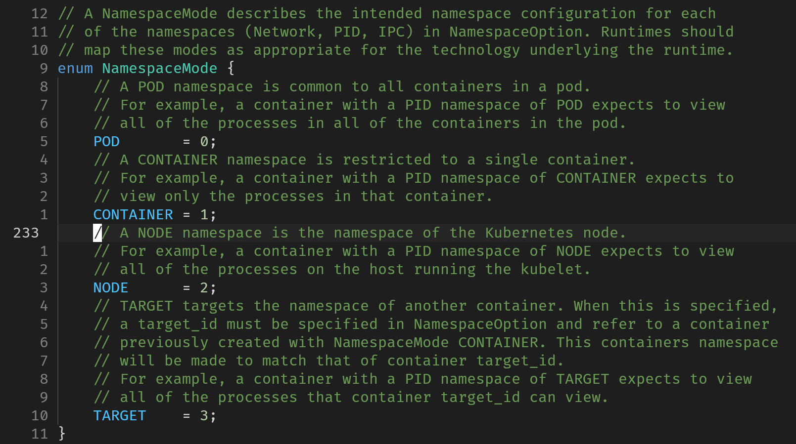

# sandbox是如何实现的？

可能的实现方案：虚拟机(KVM)、软件监狱(container)，两者都可用cgroups管理资源配额，而资源隔离的抽象则各自有不同实现（虚拟机虚拟化硬件实现，容器利用namespace抽象隔离系统级别的资源）

pod sandbox是容器的资源隔离工具，在一个pod sandbox中，就共享其中的系统资源

下面以CRI的规范版本v1为例去分析sandbox创建的执行流程

在CRI的定义中，有关于sandbox的API有5个：

```proto
service RuntimeService {
    rpc RunPodSandbox(RunPodSandboxRequest) returns (RunPodSandboxResponse) {}
    rpc StopPodSandbox(StopPodSandboxRequest) returns (StopPodSandboxResponse) {}
    rpc RemovePodSandbox(RemovePodSandboxRequest) returns (RemovePodSandboxResponse) {}
    rpc PodSandboxStatus(PodSandboxStatusRequest) returns (PodSandboxStatusResponse) {}
    rpc ListPodSandbox(ListPodSandboxRequest) returns (ListPodSandboxResponse) {}
    // ...
}

message RunPodSandboxRequest {
    // Configuration for creating a PodSandbox.
    PodSandboxConfig config = 1;
    // Named runtime configuration to use for this PodSandbox.
    // If the runtime handler is unknown, this request should be rejected.  An
    // empty string should select the default handler, equivalent to the
    // behavior before this feature was added.
    // See https://git.k8s.io/enhancements/keps/sig-node/585-runtime-class/README.md
    string runtime_handler = 2;
}
```

本质上，维护一个pod sandbox就是在维护一个pod，所以isulad的sandbox模块可以更简单地理解为pod模块

> 如果去查CRI标准，就会发现没有直接维护Pod的接口，而都是维护PodSandbox的接口

在isulad中，有两种sandbox的控制器：shim和sandboxer

前者利用pause容器的接口将sandbox管理请求转发给executor（如下图所示）；后者有单独的sandboxer进程管理底层沙箱逻辑，sandboxer控制器通过gRPC请求实现控制


其中RunPodSandbox就是申请创建一个pod所需要的资源并运行这个pod的过程，**将该过程详细分析，就能理解沙箱具体在维护什么**

## RunPodSandbox

入口通过gRPC定义来实现，客户端以gRPC的方式调用服务


下面将`m_rService->RunPodSandbox`拆分为如下图右半部分所示的调用过程逐一分析


### PrepareSandboxData

将config信息和runtime_handler信息记录到内部变量中

### EnsureSandboxImageExists 

确保指定的sandbox镜像存在（只有对于sandboxer是shim的情况需要检查）

首先会调用ImageStatus，会在集群中查找该镜像是否存在

如果ImageStatus检查调用的gRPC返回了错误，则需要额外再调用PullImage的gRPC从远端仓库(registry)拉取镜像

> 注：这里的镜像指的是在沙箱中运行的容器的镜像

### PrepareSandboxCheckpoint

该方法将配置文件生成为json格式的checkpoint，其中会有哈希值校验过程，防止出现被篡改的配置

### UpdateSandboxConfig 

将config中的label、annotation、resources等字段进行更新，设置为默认值，用于在后续调用CreateSandbox时传入作为配置

### if namespace_is_cni then PrepareSandboxKey

config中NamespaceMode配置该sandbox是用于pod还是node，前者是通用的k8s的pod（资源管理以pod为单位），后者是在一个主机上运行的抽象（资源管理以主机为单位）

在PrepareSandboxData时会设置networkMode为"cni"或"host"，若NamespaceMode为pod则networkMode为"cni"，node则networkMode为"host"

config中关于NamespaceMode的proto文件定义：



namespace_is_cni检查了当前networkMode是否是"cni"，是则执行PrepareSandboxKey，它会通过文件接口创建一个新的network namespace（随机初始化namespace名字，在isulad中被称为network/sandbox key）

### SandboxManager::CreateSandbox

先通过util_valid_container_id_or_name检查容器id或名字是否合法（简单使用正则匹配来检查）以及网络设置的检查（若网络模式为"cni"，则需要sandbox key非空）

检查完成后利用ControllerManager其实例内存储的sandboxer字符串到Controller的映射找到对应的Controller（本例以shim为例）

检查是否有旧的重名/重id/重前缀的sandbox，有则报错退出

完成后将sandbox的name传入SandboxManager生成对应的id，将二者与该sandbox的映射建立

上述初始化过程完成后，即可创建一个新的Sandbox对象

```cpp
    sandbox = std::shared_ptr<Sandbox>(new Sandbox(id, m_rootdir, m_statedir, name, info, netMode, netNsPath,
                                                   sandboxConfig, image));
    sandbox->SetController(controller);
    /// 创建相关的文件夹
    sandbox->PrepareSandboxDirs(error);
    /// 将id与sandbox指针/sandbox name的映射保存在Sandbox成员中
    SaveSandboxToStore(id, sandbox);
```

### SetupSandboxNetwork

```cc
void PodSandboxManagerService::SetupSandboxNetwork(const std::shared_ptr<sandbox::Sandbox> sandbox,
                                                   std::string &network_settings_json, Errors &error)
{
    const auto config = sandbox->GetSandboxConfig();

    sandbox->SetNetworkReady(false);
    // Setup sandbox files
    if (config.has_dns_config() && !sandbox->GetResolvPath().empty()) {
        INFO("Overwrite resolv.conf: %s", sandbox->GetResolvPath().c_str());
        /// 把config中的网络相关数据写到文件中
        SetupSandboxFiles(sandbox->GetResolvPath(), config, error);
        if (error.NotEmpty()) {
            ERROR("Failed to setup sandbox files");
            return;
        }
    }

    if (!namespace_is_cni(sandbox->GetNetMode().c_str())) {
        return;
    }

    const std::string &sandboxKey = sandbox->GetNetNsPath();
    if (sandboxKey.empty()) {
        error.Errorf("Sandbox key is invalid");
        ERROR("Sandbox key is invalid");
        return;
    }

    std::map<std::string, std::string> stdAnnos;
    /// 将annotations解析到stdAnnos的map中
    CRIHelpers::ProtobufAnnoMapToStd(config.annotations(), stdAnnos);
    stdAnnos.insert(std::pair<std::string, std::string>(CRIHelpers::Constants::POD_SANDBOX_KEY, sandboxKey));

    std::map<std::string, std::string> networkOptions;
    networkOptions["UID"] = config.metadata().uid();

    /// 将对应的network namespace的路径挂载
    if (prepare_network_namespace(sandboxKey.c_str(), false, 0) != 0) {
        error.Errorf("Failed to prepare network namespace: %s", sandboxKey.c_str());
        ERROR("Failed to prepare network namespace: %s", sandboxKey.c_str());
        return;
    }

    // Setup networking for the sandbox.
    m_pluginManager->SetUpPod(config.metadata().namespace_(), config.metadata().name(),
                              Network::DEFAULT_NETWORK_INTERFACE_NAME, sandbox->GetId(), stdAnnos, networkOptions,
                              network_settings_json, error);
    if (error.NotEmpty()) {
        ERROR("SetupPod failed: %s", error.GetCMessage());
        if (remove_network_namespace(sandboxKey.c_str()) != 0) {
            ERROR("Failed to remove network namespace: %s", sandboxKey.c_str());
        }
        return;
    }

    sandbox->SetNetworkReady(true);
    DEBUG("set %s ready", sandbox->GetId().c_str());
}
```

网络插件管理会使用`SetupPod`创建该pod的网络

### sandbox->Save

将sandbox的各种数据保存到硬盘中

分为`SaveState`、`SaveMetadata`和`SaveNetworkSetting`

`SaveState`完成了状态保存（包括何时创建、何时退出、何时更新、pod id、当前状态），将sandbox的状态生成JSON格式写入文件中

`SaveMetadata`保存id、Pod名、运行时、sandboxer、网络模式、net namespace的路径等等

`SaveNetworkSetting`保存网络设置配置信息（字符串形式）

### sandbox->Create

会利用Sandbox对象已有的参数，调用Controller类的Create方法创建sandbox，如果是shim则使用ShimController::Create创建（Controller是基类），最终交由isulad的全局executor（`g_isulad_service_executor->container.create()`）以rpc的方式完成sandbox创建

```cpp
  auto Sandbox::Create(Errors &error) -> bool
  {
      struct ControllerCreateParams params;

      // currently, params.mounts is unused.
      params.config = m_sandboxConfig;
      params.netNSPath = m_netNsPath;
      params.sandboxName = m_name;
      params.image = m_image;
      params.netMode = m_netMode;
      params.runtime = GetRuntime();
      params.sandboxer = GetSandboxer();
      params.hostname = m_sandboxConfig->hostname();
      /// ...

      if (!m_controller->Create(m_id, params, error)) {
        /// ...
          return false;
      }

      return true;
  }
```
```cpp
bool ShimController::Create(const std::string &sandboxId,
                            const ControllerCreateParams &params,
                            Errors &error)
{
    if (m_cb == nullptr || m_cb->container.create == nullptr) {
        ERROR("Unimplemented callback");
        error.SetError("Unimplemented callback");
        return false;
    }

    auto requestWrapper = GenerateSandboxCreateContainerRequest(sandboxId, params, error);
    if (error.NotEmpty()) {
        return false;
    }

    container_create_response *response {nullptr};
    int ret = m_cb->container.create(requestWrapper->get(), &response);
    auto responseWrapper = makeUniquePtrCStructWrapper<container_create_response>(response, free_container_create_response);

    if (ret != 0) {
        if (response != nullptr && (response->errmsg != nullptr)) {
            ERROR("Failed to call create container callback: %s", response->errmsg);
            error.SetError(response->errmsg);
        } else {
            ERROR("Failed to call create container callback");
            error.SetError("Failed to call create container callback");
        }
    }

    return error.Empty();
}
```

以创建容器的rpc请求创建sandbox，实际上isulad中executor唯一的调用模块就是container，container模块再调用各种运行时（lxc、runc、qemu stratovirt）完成创建

### sandbox->UpdateNetworkSettings

将`SetupSandboxNetwork`中得到的网络设置利用sandbox持久化到硬盘中

### sandbox->Start

调用`Controller`的Start方法，最终会调用`ShimController`的Start，最终同样调用了executor的接口（`g_isulad_service_executor->container.start()`）完成启动容器
