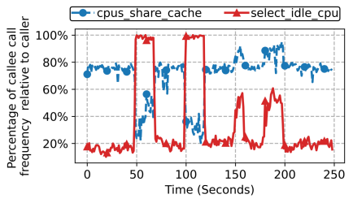
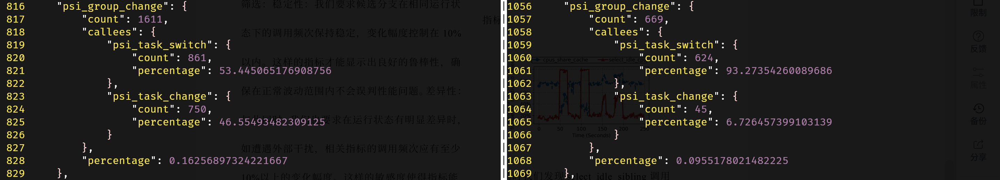
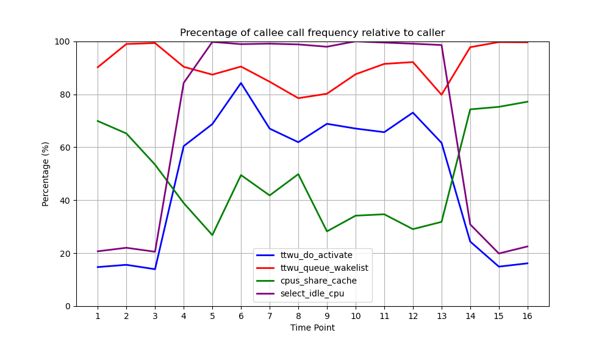

# 调用栈占比分析评判性能瓶颈

在内核函数中，使用callee（被调用者）占caller（调用者）的调用比例（或者反过来，caller占callee的比例）是一种简单而可行的分析干扰情况的方法。

当存在某种干扰时，会存在某些调用栈中**某callee占caller比例增、减、从有到无或从无到有**的可能性（也可能反过来，**某caller占callee比例增、减、从有到无或从无到有**）。

我们使用5.15.0的内核进行实验，验证该方法的**可行性**与**有效性**。

## 可行性分析

- 如下图所示，图中展示了`select_idle_sibling`调用的两个关键函数的调用占比在干扰影响下变化，左半`select_idle_cpu`调用占比上升、`cpus_share_cache`调用占比下降的部分是发生CPU干扰，右半`select_idle_cpu`和`cpus_share_cache`调用占比均提升的部分是发生了LLC干扰。在CPU干扰时，`select_idle_sibling`选目标核时会产生明显的`select_idle_cpu`调用次数的上升，达到几乎100%。



- 如下图所示，左半是发生CPU干扰时的调用占比，右半是没有CPU干扰时的调用占比。发生干扰时，`psi_task_change`会更频繁地被`ttwu_do_activate`调用，使得`psi_task_change`作为caller占`psi_group_change`的占比提升



这些调用占比的增减是否是一种偶然？还是与实际干扰的发生有强逻辑相关性？上述的例子已经足以支撑该方法在CPU干扰情况下的可行性，下面的内容将验证**调用栈占比分析评判性能瓶颈**的方法在**CPU干扰情况下**的有效性。

## 有效性分析

`psi_task_change`和`select_idle_sibling`的父调用链上都有`try_to_wake_up`，应该从其基本逻辑出发开始分析

ftrace的function_graph相关调用栈如下所示：

```c
 15)               |try_to_wake_up() {
 15)   0.195 us    |  // ...
 15)               |  select_task_rq_fair() {
 15)   0.431 us    |    // ...
 15)               |    select_idle_sibling() {
 15)   0.182 us    |      available_idle_cpu();
 15)   0.314 us    |      select_idle_cpu();
 15)   1.146 us    |    }
 15)   0.185 us    |    // ...
 15)   3.627 us    |  }
 15)   0.587 us    |  // ...
 15)               |  ttwu_do_activate() {
 15)               |    psi_task_change() {
 15)   0.191 us    |      psi_flags_change();
 15)   0.217 us    |      // ...
 15)   0.723 us    |      psi_group_change();
 15)   0.199 us    |      // ...
 15)   0.295 us    |      psi_group_change();
 15)   0.211 us    |      // ...
 15)   0.299 us    |      psi_group_change();
 15)   0.191 us    |      // ...
 15)   3.993 us    |    }
 15) + 10.187 us   |    // ...
 15) + 20.704 us   |  }
 15)   0.190 us    |  // ...
 15) + 27.971 us   |}
```

下面我们来看看两种调用栈占比变化的详细分析：

先将`try_to_wake_up`的主要调用栈用伪代码的形式展示。

伪代码表示的该部分代码的调用栈，其中大部分与C语言无异，将函数的实现全部嵌套方便查看和理解，并将需要区分形参和实参的地方用冒号进行区分（冒号左半边为形参，右半边为实参）：

```c
int try_to_wake_up(struct task_struct *p, unsigned int state, int wake_flags) {
	// ...
	cpu = (int select_task_rq(struct task_struct *p, int prev_cpu: p->wake_cpu, int wake_flags: wake_flags | WF_TTWU) {
		// ...
		int select_task_rq_fair(struct task_struct *p, int prev_cpu, int wake_flags) {
			// 在CPU干扰中，不会出现WF_SYNC，因为这是同步唤醒——即在wakee被唤醒同时使得waker睡眠
			// 这是任务协作才会有的情况（例如：互斥锁之间就可以使用WF_SYNC来互相唤醒）
			// 因此，sync在CPU干扰中恒为false
			int sync = (wake_flags & WF_SYNC) && !(current->flags & PF_EXITING);
			struct sched_domain *tmp;
			// ...
			int cpu = smp_processor_id();
			// ...
			for_each_domain(cpu, tmp) {
				// ...
				if (cpu != prev_cpu)
					new_cpu = (int wake_affine(struct sched_domain *sd: tmp, struct task_struct *p, int this_cpu: cpu, 
							int prev_cpu: prev_cpu, int sync: sync));
				// ...
			}
			// ...
			if (wake_flags & WF_TTWU) {
				/* Fast path */
				new_cpu = (int select_idle_sibling(struct task_struct *p, int prev: prev_cpu, int target: new_cpu));
			}
		}
	});
	if (task_cpu(p) != cpu) {
		if (p->in_iowait) {
			delayacct_blkio_end(p);
			atomic_dec(&task_rq(p)->nr_iowait);
		}

		wake_flags |= WF_MIGRATED;
		psi_ttwu_dequeue(p);
		set_task_cpu(p, cpu);
	}
	// ...
	void ttwu_queue(struct task_struct *p, int cpu, int wake_flags) {
		struct rq *rq = cpu_rq(cpu);
		struct rq_flags rf;

		if (ttwu_queue_wakelist(p, cpu, wake_flags))
			return;

		rq_lock(rq, &rf);
		update_rq_clock(rq);
		ttwu_do_activate(rq, p, wake_flags, &rf);
		rq_unlock(rq, &rf);
	}
	// ...
}
```
### `select_idle_sibling`相关调用栈分析

重点不光在于理顺唤醒某一任务的执行流，更重要在于在发生CPU干扰的时候，try_to_wake_up内部**被调用函数**的**调用占比**和**调用频次**所产生的变化的原因分析。


图中左半部分是CPU干扰下调用占比的变化，右半部分则是LLC干扰下调用占比的变化。

可以看到：

- 在发生CPU干扰的情况下，`select_idle_cpu`的调用占比猛增到接近100%，而`cpus_share_cache`的调用占比降低；
- 在发生LLC干扰的情况下，`select_idle_cpu`和`cpus_share_cache`的调用占比都增加，但都没有达到100%。

`select_idle_sibling`的具体实现：
```c
static int select_idle_sibling(struct task_struct *p, int prev, int target)
{
	bool has_idle_core = false;
	struct sched_domain *sd;
	unsigned long task_util, util_min, util_max;
	int i, recent_used_cpu;

	/*
	 * On asymmetric system, update task utilization because we will check
	 * that the task fits with cpu's capacity.
	 */
	if (sched_asym_cpucap_active()) {
		sync_entity_load_avg(&p->se);
		task_util = task_util_est(p);
		util_min = uclamp_eff_value(p, UCLAMP_MIN);
		util_max = uclamp_eff_value(p, UCLAMP_MAX);
	}

	/*
	 * per-cpu select_idle_mask usage
	 */
	lockdep_assert_irqs_disabled();

	if ((available_idle_cpu(target) || sched_idle_cpu(target)) &&
	    asym_fits_cpu(task_util, util_min, util_max, target))
		return target;

	/*
	 * If the previous CPU is cache affine and idle, don't be stupid:
	 */
	if (prev != target && cpus_share_cache(prev, target) &&
	    (available_idle_cpu(prev) || sched_idle_cpu(prev)) &&
	    asym_fits_cpu(task_util, util_min, util_max, prev))
		return prev;

	/*
	 * Allow a per-cpu kthread to stack with the wakee if the
	 * kworker thread and the tasks previous CPUs are the same.
	 * The assumption is that the wakee queued work for the
	 * per-cpu kthread that is now complete and the wakeup is
	 * essentially a sync wakeup. An obvious example of this
	 * pattern is IO completions.
	 */
	if (is_per_cpu_kthread(current) &&
	    in_task() &&
	    prev == smp_processor_id() &&
	    this_rq()->nr_running <= 1 &&
	    asym_fits_cpu(task_util, util_min, util_max, prev)) {
		return prev;
	}

	/* Check a recently used CPU as a potential idle candidate: */
	recent_used_cpu = p->recent_used_cpu;
	p->recent_used_cpu = prev;
	if (recent_used_cpu != prev &&
	    recent_used_cpu != target &&
	    cpus_share_cache(recent_used_cpu, target) &&
	    (available_idle_cpu(recent_used_cpu) || sched_idle_cpu(recent_used_cpu)) &&
	    cpumask_test_cpu(p->recent_used_cpu, p->cpus_ptr) &&
	    asym_fits_cpu(task_util, util_min, util_max, recent_used_cpu)) {
		return recent_used_cpu;
	}

	/*
	 * For asymmetric CPU capacity systems, our domain of interest is
	 * sd_asym_cpucapacity rather than sd_llc.
	 */
	if (sched_asym_cpucap_active()) {
		sd = rcu_dereference(per_cpu(sd_asym_cpucapacity, target));
		/*
		 * On an asymmetric CPU capacity system where an exclusive
		 * cpuset defines a symmetric island (i.e. one unique
		 * capacity_orig value through the cpuset), the key will be set
		 * but the CPUs within that cpuset will not have a domain with
		 * SD_ASYM_CPUCAPACITY. These should follow the usual symmetric
		 * capacity path.
		 */
		if (sd) {
			i = select_idle_capacity(p, sd, target);
			return ((unsigned)i < nr_cpumask_bits) ? i : target;
		}
	}

	sd = rcu_dereference(per_cpu(sd_llc, target));
	if (!sd)
		return target;

	if (sched_smt_active()) {
		has_idle_core = test_idle_cores(target, false);

		if (!has_idle_core && cpus_share_cache(prev, target)) {
			i = select_idle_smt(p, sd, prev);
			if ((unsigned int)i < nr_cpumask_bits)
				return i;
		}
	}

	i = select_idle_cpu(p, sd, has_idle_core, target);
	if ((unsigned)i < nr_cpumask_bits)
		return i;

	return target;
}
```

#### CPU干扰下`select_idle_sibling`选核频繁调用`select_idle_cpu`的分析

`select_idle_sibling`频繁调用`select_idle_cpu`的唯一可能是：`select_idle_sibling`的快速选核策略都失败了。

快速选核策略主要判断要选中的核是否idle以及该核是否与目标CPU共享LLC缓存，在CPU干扰存在的情况下，快速选核策略的失败显然更容易发生（某个CPU是idle的可能性更低），故而更频繁地调用`select_idle_cpu`。

比较图中左半部分和右半部分，可以知道：CPU干扰下`select_idle_cpu`占比达到了接近100%，这说明CPU干扰导致了各个核都有严重的计算资源占用，很难再获取到idle的CPU；
而LLC干扰下`select_idle_cpu`只是一定程度的升高，没有达到完全找不到idle状态CPU的情况。

#### CPU干扰下`select_idle_sibling`选核调用`cpus_share_cache`频次下降的分析

`cpus_share_cache`是用于判断两个核是否共享LLC缓存的函数，主要是在条件判断中被调用。
其他条件逻辑与该条件时，只要前面的条件不满足就不会调用`cpus_share_cache`（逻辑短路）。

在`select_idle_sibling`中，`cpus_share_cache`的调用主要有三处：

- 选`prev`对应的CPU的情况，判断`prev`是否和`target`共享LLC缓存

```c
	/*
	 * If the previous CPU is cache affine and idle, don't be stupid:
	 */
	if (prev != target && cpus_share_cache(prev, target) &&
	    (available_idle_cpu(prev) || sched_idle_cpu(prev)) &&
	    asym_fits_cpu(task_util, util_min, util_max, prev))
		return prev;
```

- 任务的`recent_used_cpu`并非`prev`和`target`的情况，判断`recent_used_cpu`和`target`是否共享LLC

```c
	/* Check a recently used CPU as a potential idle candidate: */
	recent_used_cpu = p->recent_used_cpu;
	p->recent_used_cpu = prev;
	if (recent_used_cpu != prev &&
	    recent_used_cpu != target &&
	    cpus_share_cache(recent_used_cpu, target) &&
	    (available_idle_cpu(recent_used_cpu) || sched_idle_cpu(recent_used_cpu)) &&
	    cpumask_test_cpu(p->recent_used_cpu, p->cpus_ptr) &&
	    asym_fits_cpu(task_util, util_min, util_max, recent_used_cpu)) {
		return recent_used_cpu;
	}
```

- 开启超线程后，没有idle状态的核的前提下，获得`prev`核的超线程，判断`prev`和`target`是否共享LLC

```c
	if (sched_smt_active()) {
		has_idle_core = test_idle_cores(target, false);

		if (!has_idle_core && cpus_share_cache(prev, target)) {
			i = select_idle_smt(p, sd, prev);
			if ((unsigned int)i < nr_cpumask_bits)
				return i;
		}
	}
```

> 注：服务器上关闭了超线程，所以这个分支是不可能进入的

在考虑缓存亲和性的调度场景下，`select_idle_sibling`中得到的目标CPU来自于`wake_affine`。

```c
static int wake_affine(struct sched_domain *sd, struct task_struct *p,
		       int this_cpu, int prev_cpu, int sync)
{
	int target = nr_cpumask_bits;

	if (sched_feat(WA_IDLE))
		target = wake_affine_idle(this_cpu, prev_cpu, sync);

	if (sched_feat(WA_WEIGHT) && target == nr_cpumask_bits)
		target = wake_affine_weight(sd, p, this_cpu, prev_cpu, sync);

	schedstat_inc(p->stats.nr_wakeups_affine_attempts);
	if (target != this_cpu)
		return prev_cpu;

	schedstat_inc(sd->ttwu_move_affine);
	schedstat_inc(p->stats.nr_wakeups_affine);
	return target;
}
```
分析`wake_affine`中得到的`new_cpu`，可以得知：

`wake_affine_idle`是选择旧CPU和目标CPU中空闲的一个CPU，二者均不空闲则会进入`wake_affine_weight`继续判断。

在CPU干扰严重时，会更加频繁地进入`wake_affine_weight`（即`wake_affine_idle`失败），这是因为更难获得idle的`this_cpu`和`prev_cpu`

`wake_affine_weight`主要比较`this_cpu`和`prev_cpu`之间的负载情况。

```c
static int
wake_affine_weight(struct sched_domain *sd, struct task_struct *p,
		   int this_cpu, int prev_cpu, int sync)
{
	s64 this_eff_load, prev_eff_load;
	unsigned long task_load;

	this_eff_load = cpu_load(cpu_rq(this_cpu));

	if (sync) {
		unsigned long current_load = task_h_load(current);

		if (current_load > this_eff_load)
			return this_cpu;

		this_eff_load -= current_load;
	}

	task_load = task_h_load(p);

	this_eff_load += task_load;
	if (sched_feat(WA_BIAS))
		this_eff_load *= 100;
	// 这里乘以capacity_of是为了平衡两个CPU的负载
	// load是根据nice值算出来的，与CPU的能力强弱无关
	// 所以在load一定的情况下，强的CPU负载更轻
	// 为了公平地完成两个CPU的负载比较，应该乘以对方CPU的能力
	this_eff_load *= capacity_of(prev_cpu);

	prev_eff_load = cpu_load(cpu_rq(prev_cpu));
	prev_eff_load -= task_load;
	if (sched_feat(WA_BIAS))
		prev_eff_load *= 100 + (sd->imbalance_pct - 100) / 2;
	prev_eff_load *= capacity_of(this_cpu);

	/*
	 * If sync, adjust the weight of prev_eff_load such that if
	 * prev_eff == this_eff that select_idle_sibling() will consider
	 * stacking the wakee on top of the waker if no other CPU is
	 * idle.
	 */
	if (sync)
		prev_eff_load += 1;

	return this_eff_load < prev_eff_load ? this_cpu : nr_cpumask_bits;
}
```

计算负载时利用该CPU的cfs_rq->avg.load_avg（该CPU的调度队列上所有调度实体的平均负载之和）得到`this_eff_load`和`prev_eff_load`。

比较两个CPU的负载大小前，`this_eff_load`加上当前任务负载`task_load`，而`prev_eff_load`减去当前任务负载`task_load`。
在CPU干扰严重时，所有CPU的负载接近相等，此时`prev_eff_load`减去`task_load`；`this_eff_load`加上`task_load`后，`this_eff_load < prev_eff_load`的可能性就更小了，进而导致选核`this_cpu`失败概率上升，使得CPU干扰严重时，`prev_cpu`被选中的概率上升

调用`cpus_share_cache`的情况1要求`prev != target`，根据上述分析，CPU干扰严重时，更有可能`prev == target`。

### `psi_task_change`调用变频繁的分析

PSI是Pressure Stall Information。它是内核中的一个性能分析工具。

以任务的粒度，在存在其他任务CPU争用、内存缺页、IO阻塞、irq阻塞等瓶颈时会统计记录系统中存在的被阻塞任务数。

在`try_to_wake_up`的相关调用栈中，`ttwu_queue`内会调用`ttwu_do_activate`，进而调用`psi_task_change`。故而重点分析`ttwu_queue`的内部逻辑。

```c
static void ttwu_queue(struct task_struct *p, int cpu, int wake_flags)
{
	struct rq *rq = cpu_rq(cpu);
	struct rq_flags rf;

	if (ttwu_queue_wakelist(p, cpu, wake_flags))
		return;

	rq_lock(rq, &rf);
	update_rq_clock(rq);
	ttwu_do_activate(rq, p, wake_flags, &rf);
	rq_unlock(rq, &rf);
}
```

其中`ttwu_do_activate`内部调用了`psi_task_change`，所以，`psi_task_change`的调用频次高低，关键在于if判断条件`ttwu_queue_wakelist`是否为true。

在进入代码解释前，可以先从实验入手分析结果。
下图的数据提供了在没有干扰和CPU干扰下`ttwu_do_activate`和`ttwu_queue_wakelist`的调用相对于`ttwu_queue`的占比：



从4s到13s之间是加入了CPU干扰的情况，可以看出，`ttwu_queue_wakelist`的调用占比没有明显变化，但`ttwu_do_activate`调用占比明显增加。

这说明`ttwu_queue_wakelist`是相对CPU干扰不敏感的调用，而`ttwu_do_activate`/`psi_task_change`则是CPU干扰敏感的。

从源码层面分析可以得出这个数据的原因：

```c
static bool ttwu_queue_wakelist(struct task_struct *p, int cpu, int wake_flags)
{
	if (sched_feat(TTWU_QUEUE) && ttwu_queue_cond(p, cpu)) {
		sched_clock_cpu(cpu); /* Sync clocks across CPUs */
		__ttwu_queue_wakelist(p, cpu, wake_flags);
		return true;
	}

	return false;
}
/// 简单来说：当目标CPU空闲或目标CPU与当前CPU不共享LLC，则迁移，返回true
static inline bool ttwu_queue_cond(struct task_struct *p, int cpu)
{
	/*
	 * Do not complicate things with the async wake_list while the CPU is
	 * in hotplug state.
	 */
	if (!cpu_active(cpu))
		return false;

	/* Ensure the task will still be allowed to run on the CPU. */
	if (!cpumask_test_cpu(cpu, p->cpus_ptr))
		return false;

	/*
	 * If the CPU does not share cache, then queue the task on the
	 * remote rqs wakelist to avoid accessing remote data.
	 */
	if (!cpus_share_cache(smp_processor_id(), cpu))
		return true;

	if (cpu == smp_processor_id())
		return false;

	/*
	 * If the wakee cpu is idle, or the task is descheduling and the
	 * only running task on the CPU, then use the wakelist to offload
	 * the task activation to the idle (or soon-to-be-idle) CPU as
	 * the current CPU is likely busy. nr_running is checked to
	 * avoid unnecessary task stacking.
	 *
	 * Note that we can only get here with (wakee) p->on_rq=0,
	 * p->on_cpu can be whatever, we've done the dequeue, so
	 * the wakee has been accounted out of ->nr_running.
	 */
	if (!cpu_rq(cpu)->nr_running)
		return true;

	return false;
}
```

显然，当目标CPU忙碌时，`ttwu_queue_cond`返回false概率更大，也就降低了迁移发生的概率，导致进入`ttwu_do_activate`而触发`psi_task_change`。

## 参考文档

[CFS负载均衡概述](http://www.wowotech.net/process_management/load_balance.html)

[Facebook的PSI文档](https://facebookmicrosites.github.io/psi/docs/overview)

[PSI原理解析与应用](https://www.cnblogs.com/Linux-tech/p/12961296.html)

[select_task_rq_fair的分析](http://www.wowotech.net/process_management/task_placement.html)
