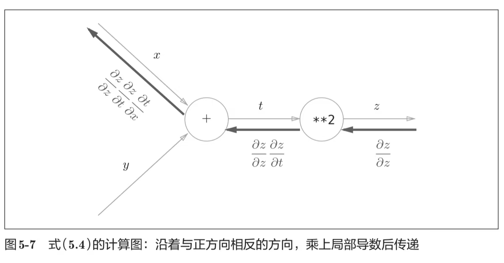
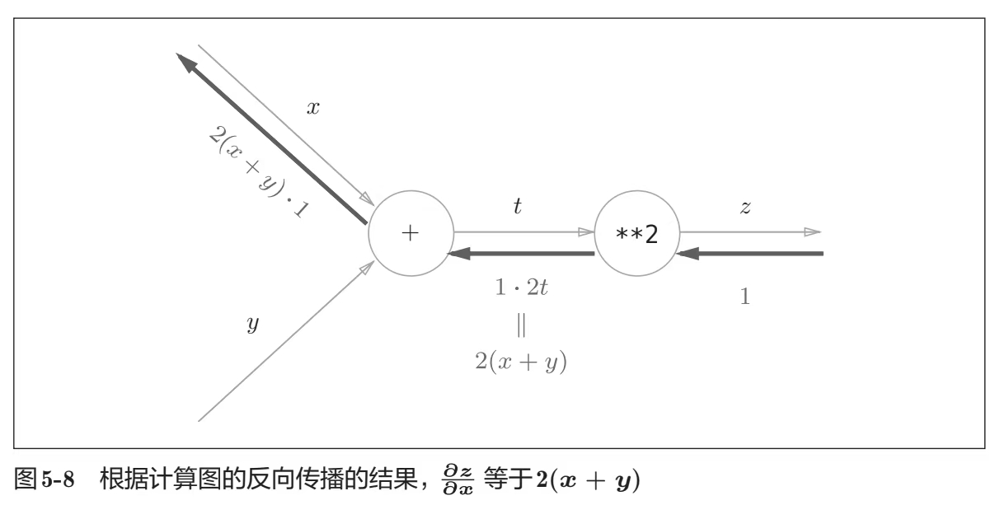

# PyTorch里的数学

## 基本数据操作

张量（`tensor`）是PyTorch中的基本数据，它可以用于表示n维数组。

一维张量用于表示向量；二维张量用于表示矩阵；三维及以上没有数学对应。

```python
import torch

# 定义了一个3行4列的矩阵，其中的元素按顺序一次从0开始到11
X = torch.arange(12).reshape(3, 4)

# 可以通过数组传入张量中的数据
Y = torch.tensor([[2, 1, 4, 3], [1, 2, 3, 4], [4, 3, 2, 1]])

# 可以对应元素间做运算
X + Y
X > Y  # 这样会形成一个相同形状的bool张量

# 可以将两个张量拼接
# 二维情况下：dim=0表示按行拼接（往下扩展），dim=1表示按列拼接（往右扩展）
torch.cat((X, Y), dim=0)
```

### 数据广播

当有两个不同形状的张量发生对应元素做计算时，有如下数据广播规则：

1. `张量X`和`张量Y`拥有不同的形状（即张量的维度数相同，但存在至少某一维度的向量长度不同），
   必须有一个张量在向量长度不同的维度其长度为1（singleton dimension），这样就可以将该张量的向量**拷贝为另一个张量的该维度长度份**用以计算。
2. 拷贝完成后即可完成**按元素计算**

```python
import torch

a = torch.arange(3).reshape((3, 1))
b = torch.arange(2).reshape((1, 2))
print(a, "\n", b)
print(a + b)
```

运行结果：

```text
tensor([[0],
        [1],
        [2]])
tensor([[0, 1]])
tensor([[0, 1],
        [1, 2],
        [2, 3]])
```

### 数据预处理

```python
import panda as pd


def preprocess_read():
    ## 写入一个csv文件（数据集）
    def write_csv(data_file: str):
        os.makedirs(os.path.dirname(data_file), exist_ok=True)
        with open(data_file, "w") as f:
            ## 注：数据中有NaN数据
            f.write(
                """NumRooms,RoofType,Price
NA,NA,127500
2,NA,106000
4,Slate,178100
NA,NA,140000
6,Poop,114514"""
            )

    write_csv(data_file)
    ## 导入csv文件数据
    data = pd.read_csv(data_file)

    ## 实例用法：统计出最多NaN的列并删除这一列
    def delete_largest_amount_of_nan_col():
        count = 0
        count_max = 0
        labels = ["NumRooms", "RoofType", "Price"]
        flag = labels[0]
        for label in labels:
            ## isna判断该列每个元素是否为nan
            count = data[label].isna().sum()
            if count > count_max:
                count = count_max
                flag = label
        data_new = data.drop(flag, axis=1)
        print(torch.tensor(data_new.to_numpy(dtype=float)))

    print(data)
    delete_largest_amount_of_nan_col()

    ## iloc可以用于类似tensor的索引方式将panda中的数据切片拿出来
    inputs, outputs = data.iloc[:, 0:2], data.iloc[:, 2]
    print(inputs)
    ## get_dummies 会将字符串的列RoofType变为RoofType_Slate、RoofType_Poop、RoofType_nan三列，并将其中的值变为True/False
    ## 呈现的效果类似one-hot表示法
    inputs = pd.get_dummies(inputs, dummy_na=True)
    print(inputs)
    ## 结果如下：
    #   NumRooms  RoofType_Poop  RoofType_Slate  RoofType_nan
    # 0       NaN          False           False          True
    # 1       2.0          False           False          True
    # 2       4.0          False            True         False
    # 3       NaN          False           False          True
    # 4       6.0           True           False         False
    ## 这个方法会将数字中的nan改为指定值
    inputs = inputs.fillna(inputs.mean())
    print(inputs)

    ## 可以用to_numpy将panda数据转换为可以为PyTorch使用的数据
    X = torch.tensor(inputs.to_numpy(dtype=float))
    y = torch.tensor(outputs.to_numpy(dtype=float))
    print(X, "\n", y)


tensor_broadcast()
```

> [!NOTE]
> 如果`pd.get_dummies(..., dummy_na=False)`，则不会有`RoofType_nan`这一列

## 线性代数

前面提到了张量可以用于表达数学中的向量和矩阵，下面我们看看除了按元素运算以外的线性代数运算该怎么实现。

### 降维

张量通过`sum`可以实现降维，将某一个或几个维度的数据压缩到一个元素上

```python
A = torch.arange(6, dtype=torch.float32).reshape(2, 3)
## A的定义如下：
# tensor([[0., 1., 2.],
#         [3., 4., 5.]])
print(A.sum())  # 从2维降到0维标量
print(A.sum(dim=0))  # 行压缩
## 结果如下：
# tensor([3., 5., 7.])
print(A.sum(dim=1))  # 列压缩
## 结果如下：
# tensor([ 3., 12.])
```

::: details
旧版本传入的是`axis`，新版本将这个参数改为了`dim`

（但暂时还兼容旧版本，可以使用`axis`，只是LSP会报错）
:::

#### 非降维求和

非降维求和可以让数据保留维度信息

```python
print(A.sum(dim=1, keepdims=True))
## 结果如下：
# tensor([[ 3.],
#         [12.]])
```

> [!NOTE]
> 张量和向量、矩阵有一点不太一致：数学上向量和矩阵的维度可以视为相同的，都是二维（只不过向量在其中一个维度上的长度为1），所以只要满足要求向量和矩阵是可以做点乘运算的
>
> 而张量既可定义的只有一个维度的向量，也可以定义有两个维度的向量。因此定义为两个维度的向量与矩阵直接点乘运算的方法名和一个维度的向量的方法名有所不同

### 矩阵乘法

```python
# 向量点积
x = torch.arange(3, dtype=torch.float32)
y = torch.ones(3, dtype=torch.float32)
print((x, y, torch.dot(x, y)))
# (tensor([0., 1., 2.]), tensor([1., 1., 1.]), tensor(3.))
# 矩阵乘法 - 矩阵和向量（一维张量）乘
print((A.shape, x.shape, torch.mv(A, x), A @ x))
# (torch.Size([2, 3]), torch.Size([3]), tensor([ 5., 14.]), tensor([ 5., 14.]))
# 矩阵乘法 - 矩阵和向量（二维张量）乘
x.reshape(3, 1)
print((A.shape, x.shape, torch.mm(A, x), A @ x))
# 结果为：
# (torch.Size([2, 3]),
# torch.Size([3, 1]),
# tensor([[ 5.],
#         [14.]]),
# tensor([[ 5.],
#         [14.]]))
# 矩阵乘法 - 矩阵和矩阵乘
B = torch.ones(3, 4)
print(A, B, (torch.mm(A, B), A @ B))
# 结果为：
# (tensor([[0., 1., 2.],
#         [3., 4., 5.]]),
# tensor([[1., 1., 1., 1.],
#         [1., 1., 1., 1.],
#         [1., 1., 1., 1.]]),
# tensor([[ 3.,  3.,  3.,  3.],
#         [12., 12., 12., 12.]]),
# tensor([[ 3.,  3.,  3.,  3.],
#         [12., 12., 12., 12.]]))
```

> [!NOTE]
> 方法`torch.ones()`默认返回的就是float32的数据

---

> [!TIP]
> 显然直接使用`A @ B`这样的写法更加省心
>
> 而这种写法显然是用了运算符重载实现的，只要在类内实现了`__matmul__`既可完成矩阵乘法运算
>
> [相关的Python官方文档](https://docs.python.org/3/whatsnew/3.5.html#pep-465-a-dedicated-infix-operator-for-matrix-multiplication)

### 范数

最初是针对向量提出的概念，用于表示一个向量的大小（不是维度个数）。

向量范数是将向量映射到标量的函数$f$，向量范数必须满足下面三个要求：

$$ f(\alpha \mathbf{x}) = |\alpha|f(\mathbf{x}) $$

$$ f(\mathbf{x + y}) \le f(\mathbf{x}) + f(\mathbf{y}) $$

$$ f(\mathbf{x}) \ge 0 $$

常见的范数：

- $L_p$范数：

  $$ \|\mathbf{x}\|_p = (\sum_{i=1}^n |x_i|^p)^\frac{1}{p} $$

> [!TIP]
> 常见的$L_1$范数和$L_2$范数都是这个$L_p$范数的特殊情况（$p=\{1,2\}$）

---

> [!NOTE]
> 常见的范数一般都指$L_2$范数，通常它都会省略下标：$\|\mathbf{x}\|$等价于$\|\mathbf{x}\|_2$
>
> 向量可以这样求$L_2$范数：
>
> ```python
> u = torch.tensor([3.0, -4.0])
> torch.norm(u)  # 5
> ```
>
> 想求$L_1$范数比较简单，因为它就是求各个分量绝对值的和：
>
> ```python
> torch.abs(u).sum()
> ```

- 矩阵的Frobenius范数：
  $$
  \|\mathbf{x}\|_F = \sqrt{\sum_{i=1}^m \sum_{j=1}^n x_{ij}^2}
  $$

> [!NOTE]
> 它和向量$L_2$范数很类似，所以在PyTorch中获得矩阵范数的方法也和获取向量范数的方法很类似：
>
> ```python
> torch.norm(torch.ones((4, 9)))  # 6
> ```

---

> [!TIP]
> 将矩阵范数进一步推广到张量上，其实就可以得到n维张量的范数：
>
> $$
> \|\mathbf{x}\|_F = \sqrt{\sum_{i_1 =1}^{l_1} \sum_{i_2 =1}^{l_2} ...
>                            \sum_{i_n =1}^{l_n} x_{i_1 i_2...i_n}^2}
> $$
>
> PyTorch中对任意维度的张量的计算结果也满足上式
>
> ```python
> A = torch.ones(2, 2, 4)
> print(A.norm())  # 4
> ```

## 微积分

微积分基本概念讲得很浅，这些东西早就在数学课上学得滚瓜烂熟了

主要关注梯度的一个结论和自动微分的原理：

### 梯度

梯度定义：

$$
\nabla_\mathbf{x} f(\mathbf{x}) = [\frac{\partial f(\mathbf{x})}{\partial x_1},
                                     \frac{\partial f(\mathbf{x})}{\partial x_2},
                                 ... \frac{\partial f(\mathbf{x})}{\partial x_n}]^T
$$

假设$\mathbf{x}$为n维向量，有以下梯度计算结论：

- 对于所有$A \in \mathbb{R}^{m\times n}$，都有$\nabla_\mathbf{x} \mathbf{Ax} = \mathbf{A^T}$
- 对于所有$A \in \mathbb{R}^{m\times n}$，都有$\nabla_\mathbf{x} \mathbf{x^T A} = \mathbf{A}$
- 对于所有$A \in \mathbb{R}^{m\times n}$，都有
  $\nabla_\mathbf{x} \mathbf{x^T Ax} = \mathbf{(A+A^T)x}$
- $\nabla_\mathbf{x} \|\mathbf{x}\|^2 = \nabla_\mathbf{x} \mathbf{x^T x} = \mathbf{2x}$

> [!NOTE]
> 该书中介绍的梯度$\nabla_\mathbf{x} \mathbf{Ax}$与雅可比矩阵恰好互为转置。这只是记法不同罢了，无须深究
>
> 另外，初学时可能对向量$\mathbf{y}$对向量$\mathbf{x}$求导的概念不清晰，会觉得梯度运算可以直接透穿到矩阵内对每个标量完成计算即可，这样会导致出现一个超长向量的出现，对于矩阵梯度的计算结论设计不利（将会丢在标量上的求导计算规律），数学上并没有采用这种方式

### 自动微分

PyTorch支持通过**反向传播**计算一个标量$y$对向量$\mathbf{x}$的梯度。

:::details
反向传播算法：我很喜欢《深度学习入门：基于Python的理论与实现》中给出的计算图抽象来理解这个概念

如果你不知道反向传播，推荐去看看这本书第五章




:::

```python
import torch

x = torch.arange(4.0, requires_grad=True)  # 将x标记为求梯度的自变量
print(x.grad)  # 初始值为None
y = 2 * torch.dot(x, x)  # y = 2x^T*x （假设x是列向量）
y.backward()  # y'= 4x     （类似x是标量时的y=2x^2的求导）
print(x.grad)  # tensor([0., 4., 8., 12.])

# 在默认情况下，PyTorch会累积梯度，我们需要清除之前的值
x.grad.zero_()
y = x.sum()
y.backward()
print(x.grad)  # tensor([1., 1., 1., 1.])
```

> [!WARNING]
> 多次`backward`默认会在自变量上累计梯度，如果不需要一定记得用`grad.zero_()`清除

#### 非标量输出变量的反向传播

数学上向量$\mathbf{y}$对向量$\mathbf{x}$求导，结果应该是雅可比矩阵$J$

$$
J = (\frac{\mathbf{\partial y}}{\partial x_1} ...
\frac{\mathbf{\partial y}}{\partial x_n}) = \begin{pmatrix}
\frac{\partial y_1}{\partial x_1}&\cdots &\frac{\partial y_1}{\partial x_n}\\
\vdots &\ddots &\vdots \\
\frac{\partial y_m}{\partial x_1}&\dots &\frac{\partial y_m}{\partial x_n}
\end{pmatrix}
$$

但是PyTorch求解梯度的目的不是纯粹的数学推导，而是完成神经网络的反向传播计算，因此PyTorch的`torch.autograd`需要一个标量$l$作为真正的最终结果

在输出为向量$\mathbf{y}$的情况下，还需要一个向量$\mathbf{v}$作为标量函数$l=g(\mathbf{y})$的梯度：

$$
\mathbf{v}=\begin{pmatrix}\frac{\partial l}{\partial y_1} ...
\frac{\partial l}{\partial y_m}\end{pmatrix}^T
$$

则根据链式法则

$$
\frac{\partial z}{\partial \mathbf{x}}=
(\frac{\partial \mathbf{y}}{\partial \mathbf{x}})^T \frac{\partial z}{\partial \mathbf{y}}
$$

`torch.autograd`最终计算的是以$\mathbf{x}$为自变量的标量$l$的梯度：

$$
J^T\cdot \mathbf{v} =
\begin{pmatrix}
\frac{\partial y_1}{\partial x_1}&\cdots &\frac{\partial y_m}{\partial x_1}\\
\vdots &\ddots &\vdots \\
\frac{\partial y_1}{\partial x_n}&\dots &\frac{\partial y_m}{\partial x_n}
\end{pmatrix}
\begin{pmatrix}
\frac{\partial l}{\partial y_1}\\
\vdots\\
\frac{\partial l}{\partial y_m}
\end{pmatrix}
= \begin{pmatrix}
\frac{\partial l}{\partial x_1}\\
\vdots\\
\frac{\partial l}{\partial x_n}
\end{pmatrix}
$$

综上，`torch.autograd`是计算**向量雅可比点乘**的框架（而不是直接算雅可比矩阵的框架）

实际使用时的代码往往是批处理训练(batch)时需要计算每一个标量y各自的梯度的和，则可以这样写：

```python
import torch

x = torch.arange(4.0, requires_grad=True)  # 将x标记为求梯度的自变量
y = x * x
# 这里指定的gradient就是向量v，定义的l=y1+...+yn（批处理把每个输入得到的y加在一起了）
y.backward(gradient=torch.ones(len(y)))  # Faster: y.sum().backward()
x.grad
```

#### 分离计算

有时，我们希望将某些计算移动到记录的计算图之外。 例如，假设y是作为x的函数计算的，而z则是作为y和x的函数计算的。
想象一下，我们想计算z关于x的梯度，但由于某种原因，希望将y视为一个常数， 并且只考虑到x在y被计算后发挥的作用。

这里可以分离y来返回一个新变量u，该变量与y具有相同的值， 但丢弃计算图中如何计算y的任何信息。
换句话说，梯度不会向后流经u到x。
因此，下面的反向传播函数计算z=u*x关于x的偏导数，同时将u作为常数处理，
而不是z=x*x\*x关于x的偏导数。

```python
import torch

x = torch.arange(4.0, requires_grad=True)  # 将x标记为求梯度的自变量
y = x * x
u = y.detach()
z = u * x

z.sum().backward()
print(x.grad == u)  # tensor([True, True, True, True])

x.grad.zero_()
y.sum().backward()
print(x.grad == 2 * x)  # tensor([True, True, True, True])
```

> [!NOTE]
> 随后再次backword就可以得到y到x的梯度信息（去除了z的另一条分支）

#### 带python控制流的梯度计算（动态反向传播图）

```python
def f(a):
    b = a * 2
    while b.norm() < 1000:
        b = b * 2
    if b.sum() > 0:
        c = b
    else:
        c = 100 * b
    return c


a = torch.randn(size=(), requires_grad=True)
d = f(a)
d.backward()
# d=f(a)是分段线性函数，所以任意位置的微分应该都和d / a相等
print(a.grad == d / a)  # tensor(True)
```

## 概率论

概率论基本概念有一个比较特殊的没学过的概念可以看看：[多项分布](https://math.fandom.com/zh/wiki/%E5%A4%9A%E9%A1%B9%E5%88%86%E5%B8%83)

```python
import torch
from torch.distributions.multinomial import Multinomial
import matplotlib.pyplot as plt

# 投🎲：各个面概率相等，用多次投出的结果统计频率会趋近于概率
fair_probs = torch.ones(6) / 6
print("概率：", fair_probs)
counts = Multinomial(1000, fair_probs).sample()
print(counts)
print("频率：", counts / 1000)

# 可以可视化看看随着投出次数增长频率的变化情况
counts = Multinomial(10, fair_probs).sample((500,))
cum_counts = counts.cumsum(dim=0)
estimates = cum_counts / cum_counts.sum(dim=1, keepdim=True)

for i in range(6):
    plt.plot(estimates[:, i].numpy(), label=("P(die=" + str(i + 1) + ")"))
plt.axhline(y=0.167, color="black", linestyle="dashed")
plt.gca().set_xlabel("Groups of experiments")
plt.gca().set_ylabel("Estimated probability")
plt.legend()
plt.show()
```

结果会类似下面这张图：

