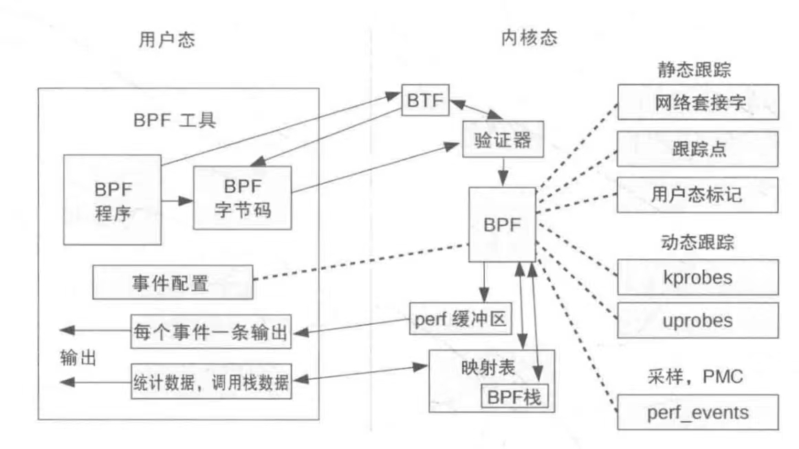
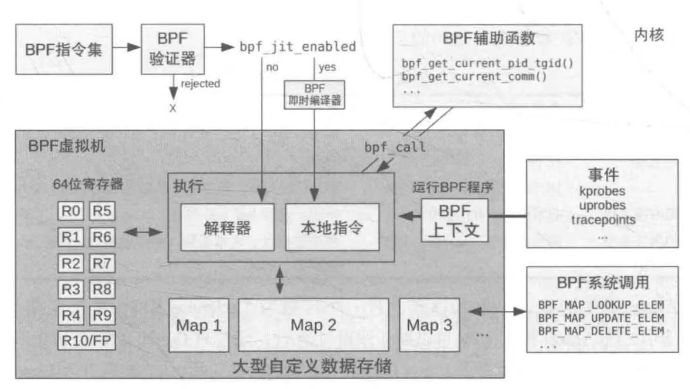
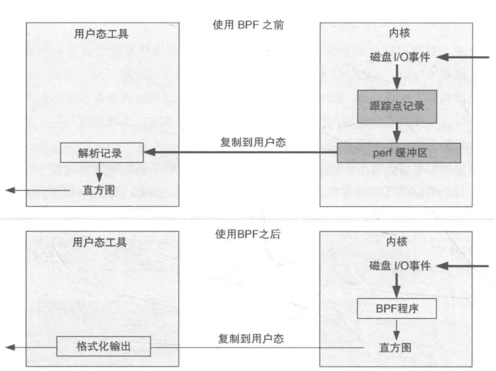

# eBPF内容介绍

## 背景知识

eBPF提供一种嵌入内核的**跟踪**事件记录的检测方式——
其中跟踪事件记录指将某一个事件源的原始信息通过**用户指定的方式**（而不是内部程序写死的日志）进行记录

它可以让你使用一种eBPF提供的BPF指令（类似Java的字节码指令的虚拟指令），在经过验证器(verifier)检验没有危害内核的代码后，交由内核中的BPF虚拟机执行事件源的插入用以完成采样



图中映射表是BPF程序的“数据段”，内部存储了BPF程序全局可访问的数据，以键值对的形式进行访问

> 注1：图中的BTF是用来提供BPF程序的数据类型、函数信息和行信息的调试符号数据格式（BTF ELF规范包括内核API和BTF ELF格式）

> 注2：为什么要用BPF指令，而不是直接使用本机的机器指令？
>
> 很大的原因就是很难形式化验证代码中的机器指令是否会危害内核
>
> 使用BPF这样功能受限的指令集可以保证内核不被破坏

> 注3：使用虚拟指令是否会导致其运行效率堪忧？
>
> 实际上不会，因为它使用了JIT（即时编译）技术，保证每一次实际运行的都是编译好的机器指令，充分流水化和乱序执行



为了保证BPF程序的运行不会破坏正常的内核执行（安全性），BPF程序不允许随意调用内核函数，而是使用内核专门提供的BPF可以调用的辅助函数(helper functions)

```bash
man 7 bpf-helpers   # 罗列了当前内核支持的BPF辅助函数
```

故而，BPF程序不能直接调用`printk`，而是使用`bpf_trace_printk`

内核还提供了用户程序可以呼叫的BPF系统调用，使用`bpf(2)`系统调用的第一个参数传递选择BPF系统调用类型

### 为什么性能工具需要BPF技术？

从功能上看，BPF工具和以往Linux内核传统的技术几乎无异：

ftrace同样可以实现以下功能：

1. 某个函数触发后函数调用栈父函数和子函数的执行时间分析
2. 函数调用总时长统计
3. 函数在何时被调用的时间戳记录
4. 正则匹配的内核函数插桩功能

BPF真正突出的优势在于：它可以将数据处理留在内核态完成，而不需要将大量的待分析数据从内核态拷贝到用户态，让用户态前端做解析



> 实际上，BPF工具不仅可以作为性能工具，还可以作为内核模块的一个有力替代工具——它能保证你实现的内核功能是安全的，从而防止因为内核模块而破坏整个系统运行的情况产生

### BCC & bpftrace

使用BPF指令直接编写BPF程序过于繁琐，通常我们使用BCC(BPF Compiler Collection)或bpftrace编写BPF程序

前者是编写内核BPF程序的C语言环境，也提供了其他高级语言的用户端接口；后者提供专门用于创建BPF工具的bpftrace脚本语言支持

BCC和bpftrace二者具有互补性，bpftrace编写功能强大的单行程序和短小的脚本时十分理想；BCC适合开发复杂的脚本和**作为后台进程使用**

> 注：本人在写内核函数调用次数监控的时候使用了bpftrace，但后续容器化使用时遇到了一些困难：对于需要不定长时间的事件收集，它需要接收SIGINT来打印结果并退出前台的事件收集程序，而容器很难使用这种交互方式来收集数据
>
> 故而在后续的BPF技术做事件跟踪记录时可能会使用BCC的C语言程序进行（加入网络通信端口的REST API作为控制监控程序的入口）

### 事件源

事件源可以分为静态插桩、动态插桩和性能监控计数器等，下面将一一讲解

#### 静态插桩

包括tracepoints和USDT(user-level statically defined tracing)，前者用于内核，后者用于用户态程序

##### tracepoints

tracepoints是内核定义的，用户无法根据自己的需要在任意地方添加tracepoint，但也正因如此，其插桩效率比动态插桩要高

它的实现利用了“静态跳转补丁”技术，实现如下：

1. 内核编译阶段在tracepoint位置插入一条不做任何工作的指令（x86-64中使用了5个字节的nop指令，保证可以被替换为5个字节的jmp指令）
2. 函数尾部return替换为一个tracepoint处理函数的jmp指令，该函数也叫跳板函数（trampoline），该函数会遍历一个存储tracepoint探针回调函数的数组（在内核中就有这个函数，但数组是在数据段动态添加删除的）
3. 执行过程中，某个tracepoint启用时：
   1. 在tracepoint回调函数数组插入一条新的回调函数（以RCU形式同步更新）
   2. 若该tracepoint之前为禁用状态（disable状态），nop指令地址会被覆盖为jmp指令用以跳转到跳板函数
4. 禁用某个tracepoint时：
   1. 在tracepoint回调函数数组中删除该回调函数（以RCU形式同步更新）
   2. 若最后一个回调函数被删除，则将jmp指令改回nop指令

> 上述实现原理也说明了一件事：单个tracepoint是可以承载多个插桩函数的

BCC和bpftrace提供的tracepoints支持接口：

- BCC: TRACEPOINT_PROBE()
- bpftrace: tracepoint探针类型

在bpftrace中tracepoint探针使用实例如下：

```bash
sudo bpftrace -e 'tracepoint:sched:sched_process_exec { printf("exec by %s\n", comm); }'
```

##### USDT

用户态预定义静态跟踪，提供用户空间的tracepoints

其实现方式与tracepoints是类似的，也是修改编译程序时预留的nop指令为jmp指令（x86）

BCC和bpftrace提供的USDT支持接口：

- BCC: USDT().enable_probe()
- bpftrace: usdt探针类型

#### 动态插桩

动态插桩可以分为kprobes和uprobes，前者用于内核态函数插桩，后者用于用户态函数插桩

##### kprobes

kprobes技术包括了kprobe插桩和kretprobe插桩，二者联动可以实现函数执行时间的统计等特殊应用

- kprobe插桩：

1. 将原本要执行的指令复制并保存
2. 利用调试中断覆盖函数入口第一条指令（x86-64中是int3，一个字节，可以保证不会覆盖超过一条指令，如果开了优化是jmp指令以减少上下文切换开销）
3. 断点程序检查断点是否为kprobes注册，是则执行kprobes处理函数
4. 处理函数中保存了被复制的原本要执行的指令，原始指令在该处理函数内被执行
5. 调试中断返回，执行流回到被探测指令之后的正常执行流
6. 当kprobe被删除时，原始的字节内容会被复制回目标地址，这样这些指令就回到它们的初始状态

- kretprobe插桩：

1. 对函数入口进行kprobe插桩
2. 当函数入口被kprobe命中后，将返回地址保存并替换为一个跳板(trampoline)函数地址
3. 当函数最终返回时（ret指令），CPU将控制交给跳板函数（jmp指令跳转）
4. kretprobe处理完成后回到之前保存的地址（ret指令返回）
5. 不再需要kretprobe时，函数入口的kprobe就被移除了

> 比较kprobe和tracepoint的原理实现可以看出：kprobes会破坏流水线，总是需要单步执行正常执行流的指令；而tracepoints只是修改了编译器预留的nop指令，不会破坏流水线
>
> 故而在实际使用中，能够用tracepoints插桩做性能分析的就不要使用kprobes

BCC提供attach_krpobe()/attach_kretprobe()函数；bpftrace提供kprobe/kretprobe探针类型作为kprobes的插桩接口

##### uprobes

uprobes也包括了uprobe和uretprobe两种插桩，它们的实现和kprobes类似

BCC提供attach_uprobe()/attach_uretprobe()函数；bpftrace提供uprobe/uretprobe探针类型作为uprobes的插桩接口

#### 性能监控计数器

PMC（Performance monitoring counter）主要是指硬件支持的可编程计数器

PMC是性能分析中至关重要的资源，可以最大限度降低性能分析和监控本身带来的性能开销，同时还能监控一般软件无法监控的细粒度性能分析内容（例如缓存命中率、IPC、阻塞指令周期、内存和设备总线利用率等）
