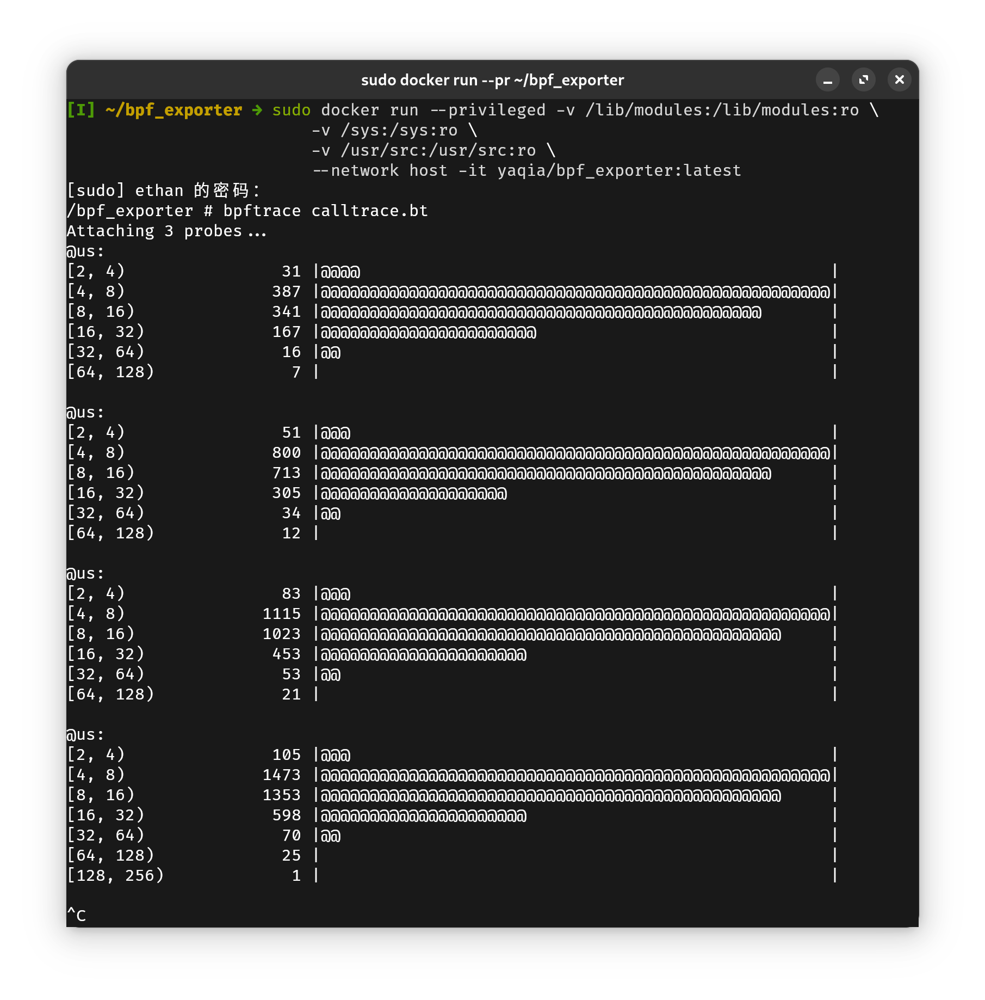

# 将程序部署到k8s中运行

## 构建docker镜像

写好Dockerfile文件，使用docker build即可构建需要的容器镜像，具体方法如下：

写好一个bpftrace程序作为入口程序：

```bpftrace
#!/usr/local/bin/bpftrace

kprobe:vfs_read
{
  @start[tid] = nsecs;
  @count = count();
}

interval:s:1
{
  print("vfs_read:", @count);
  delete(@count);
}
```

再在同目录下创建一个Dockerfile：

```Dockerfile
FROM alpine
COPY . /bpf_exporter
WORKDIR /bpf_exporter
RUN apk update \
    && apk add bcc-tools bpftrace bpftrace-tools
    # && ln -s $(which python3) /usr/bin/python
CMD sh
```

使用docker build命令构建容器镜像，并将其上传至dockerhub：

```bash
docker build --network=host -t yaqia/bpf_exporter .
docker push yaqia/bpf_exporter  # 注：在运行这一行之前需要在dockerhub中提前创建好仓库
```

> 注：这里编译使用了`--network=host`，主要是因为该镜像构建需要下载BCC和bpftrace及其工具的软件包

由于eBPF需要用到内核态服务，需要超管权限，还需要读取一些系统目录的数据，应该使用如下方式启动容器：

```bash
sudo docker run --privileged   -v /lib/modules:/lib/modules:ro \
  -v /sys:/sys:ro \
  -v /usr/src:/usr/src:ro --network host -it yaqia/bpf_exporter:latest
```

:::info
参考自[BCC文档](https://github.com/iovisor/bcc/blob/master/INSTALL.md#alpine---binary)，若内容有更改以文档为准
:::

:::tip
普通的容器是不应该用这种方式运行的，因为这样会严重破坏容器的隔离性（mount namespace、user namespace以及capabilities限制都失去作用），容易造成容器逃逸
:::

运行效果如下：



:::tip
这里的程序不是函数调用次数统计，在dockerhub上打包的镜像也不是，而是vfs_read函数调用时长的直方图统计，请注意辨别
:::

:::tip
如果想在启动时直接执行该段程序，可以更改Dockerfile中的CMD为`bpftrace calltrace.bt`
:::

## 在k8s上部署运行eBPF程序

### 用到的k8s管理工具：daemonSet

k8s中的一种资源，daemonSet可以保证所有节点运行指定的Pod副本，有新节点加入集群时，也会为它们创建相应的Pod

:::tip
实际上daemonSet也可以用label指定部分节点运行
:::

:::info
如果你完全不了解k8s相关术语：节点表示的就是主机（不论虚拟的还是实际的），Pod是封装容器的基本单位
:::

要在k8s中运行一个用户配置的资源，只需要写好其yaml配置文件即可（基本的注释都已经写在配置中了，如果还有不理解的可以查阅[这份文档](https://kubernetes.io/zh-cn/docs/concepts/workloads/controllers/daemonset/)）：

```yaml
# daemonset.yaml
apiVersion: apps/v1
kind: DaemonSet # 指定k8s资源类型
metadata:
  name: bpf-exporterd
  namespace: default
  labels:
    app: bpf-exporterd
spec:
  selector:
    matchLabels:
      app: bpf-exporterd
  template:
    metadata:
      annotations:
        kubectl.kubernetes.io/default-container: bpf-exporterd
      labels:
        app: bpf-exporterd
    spec:
      tolerations:
      containers: # 指定容器的相关参数
        - name: bpf-exporterd
          image: yaqia/bpf_exporter
          resources:
            limits:
              memory: 200Mi
            requests:
              cpu: 100m
              memory: 200Mi
          command: ["/usr/share/bcc/tools/funccount", "-i 1", "vfs_*"] # 指定容器中运行的命令，覆盖Dockerfile中的CMD
          # command: ["/usr/share/bcc/tools/stackcount", "-i 1", "vfs_*"]
          securityContext: # 容器权限设置，保证拥有超管权限运行
            # allowPrivilegeEscalation: false
            privileged: true
            runAsUser: 0
          volumeMounts: # 绑定主机的路径到容器中
            - mountPath: /sys
              name: sysfs
              readOnly: true
            - mountPath: /lib/modules
              name: lib-modules
              readOnly: true
            - mountPath: /usr/src
              name: usr-src
              readOnly: true
            - name: var-log
              mountPath: /var/log
      terminationGracePeriodSeconds: 30
      volumes:
        - name: sysfs # 在k8s中，卷(volumes)资源有很多种
          hostPath: # hostPath是其中用来将主机路径映射到容器中的卷
            path: /sys
        - name: lib-modules
          hostPath:
            path: /lib/modules
        - name: usr-src
          hostPath:
            path: /usr/src
        - name: var-log
          hostPath:
            path: /var/log
```

注意这里使用了`funccount`替换了`bpftrace calltrace.bt`，只是为了说明这里实现函数调用次数统计有很多方法

在k8s的master节点中，执行：

```bash
kubectl apply -f daemonset.yaml
```

要想查看pods的运行情况，执行：

```bash
kubectl get pods
```

确认正在运行无误后，再执行：

```bash
kubectl logs -f bpf-exporterd-jw4hm # 这里填pod名
```

即可看到监控程序运行的情况了
