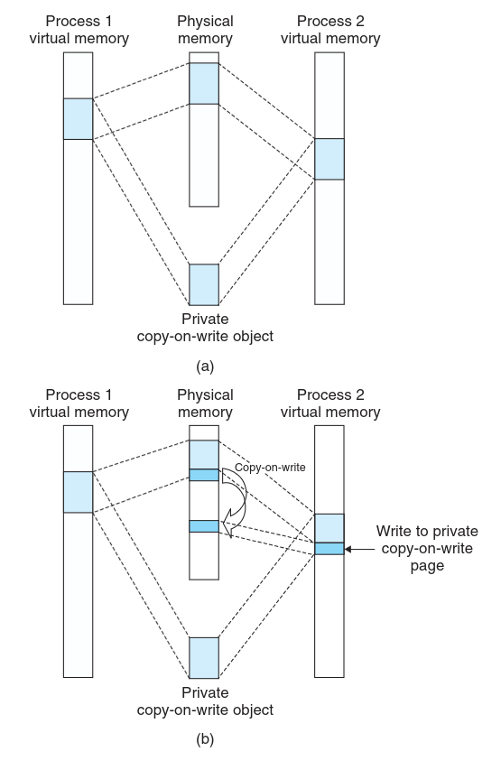

# 内核的写时复制 CoW 究竟有哪些的触发方式？

## 引子：什么叫单一进程拥有的 VMA 触发了 CoW？

最近在实现一个内核特性（`sched_hint`）：内核拥有一段页面，把它映射进用户进程；用户态往里面写“调度提示”标签，sched_ext/BPF 调度器则通过内核侧的指针直接读取这些标签。需求用一句话概括就是——**同一段物理页，用户态要写、内核要读**。

由于用户态的每一个线程都需要独立存储它们的标签数据，我们定义的这个内存模型需要支持可变长度的标签集合。为实现这个效果，我们的实现是：用一系列的 VMA 组织链表，最开始的 VMA 只有 1 个页（一个 4KiB 的页已经够 64 个线程使用了），随后如果需要扩容就会有

$$ VMA 页容量 = VMA 页容量_{last} \times 2 $$

用户态线程通过 prctl 来申请自己的标签的预留内存，内核态在分配完内存后，将 prctl 的标签指针参数保存了标签的虚拟内存地址信息（$ VMA 基址 + 偏移量 $的虚拟地址映射）。在访存时，我们让内核态直接用内核的直接映射区来访问；用户态则用标签指针来访问。在用户态 page fault 时，用自定义的回调来创建页、完成回填。

设计挺“完美”的，但是实机验证时出现了一个诡异现象：

- 用户通过 prctl 申请自己线程的 `sched_hint` 内存槽（slot）；
- 内核在返回 slot 时写好了标签的元数据信息；
- 用户态在对标签值修改过后，读回的数据变成了全零（在这之前是正常能读取出元数据信息的）；
- 而且**只有“被用户态写过的那一页”如此**，从没被写过的页（同进程的第二段、fork/exec 出来的子进程）一切正常。

这些迹象说明内核对用户态写过的页触发了写时复制（CoW, Copy-on-Write），导致它被映射到的内存区域与内核管理的内存区域不再是一个区域。

可是……我这个内核页只有单一进程拥有，没有被其他进程使用的情况下，为什么会触发写时复制 CoW？难道 CoW 不是多个进程共同映射一个对象，但又互不共享这个对象导致的吗？



实际上，CoW 不仅仅是多个进程共同映射一个不共享对象会出现，在内核中有多种原因可能触发 CoW。不共享对象的页是否触发 CoW 的核心不是单一进程使用与否，而是是否有多个使用者。

比如，一个不共享/私有的对象在一个进程内有两套 VMA 映射，其中一个试图写时，就需要 CoW —— 这其实很自然，因为两套 VMA 都映射到一个不共享对象中，那么其中一个想写的时候就必须将这个页拷贝出去重新单独映射。

但是这无法解释我们遇到的问题：一个内核创建管理的 VMA，没有多个 VMA 映射到同一个不共享对象，属于独占的情况，为什么依然触发了 CoW？

为了解决这个头疼的问题，我决定先深入阅读内核中 mm 的相关代码。

## 一、VMA 相关的三个概念：私有、匿名、独占

为了避免后续的讲解内容给大家带来困惑，我先在这里将三个关键的概念理清楚，在后续讲解 CoW 的触发条件时就可以直接用这些概念来分类了。

### 1.1 私有 / 共享：VMA 的“写可见性”

这是 VMA 的属性，也是 mmap 的一个 flag。回答的问题是：**对这段地址的写，能不能被别人（或背后的对象）看见？**

- **私有（private）**(mmap flag: `MAP_PRIVATE`)：内存写在语义上仅作用于当前进程，**不能穿透到背后的对象**，也不能影响其他映射者。
- **共享（shared）**(mmap flag: `MAP_SHARED`)：写就是直接作用在对象/共享页上，其他映射者立刻可见。

注意：**private 描述的是“写可见性”，不是这个页仅被当前 VMA 占用**。私有映射背后完全可能有一个被其他 VMA 也共享着的对象。

> [!TIP]
> 你可能会问这里说的“对象”具体是指什么东西，下面一节会罗列 Linux 中有哪些常见的对象。

### 1.2 匿名 / 非匿名：VMA 背后“有没有对象”

这也是 VMA 的属性，回答的问题是：**这段地址背后有没有一个“对象”？**

- **匿名（anonymous）**：背后没有对象，就是一段普通内存（堆、栈、`MAP_ANONYMOUS|MAP_PRIVATE`）。缺页时无对象可查，直接“分配一个新页”即可。
- **非匿名（backed）**：背后有一个对象——文件、shmem、vDSO、驱动映射、内核的特殊页……缺页时要向这个对象“取页”。

> [!TIP]
> 内核理解的匿名与用户态的mmap flag的 `MAP_ANONYMOUS` 不完全一样，我们会在后续讲到这个细微区别（见 §5.3）。

### 1.3 独占：匿名页的“唯一使用者”

前面两个都是 **VMA** 的属性，而“独占”是 **页** 的属性，且只有匿名页有这个属性，它回答的问题是：**这份匿名物理页此刻是不是只有唯一一个进程占用？**

- 独占的页可以直接改。
- 一旦被多方共享（比如 `fork` 之后父子都映射着它），就不再独占，任何一方想写都得先"分家"。

**这里必须明确“使用者”的粒度：它是“独立的地址空间（`mm`，即进程）”，不是线程数。** 这个粒度决定了很多场景会不会触发 COW：

- **多线程共享同一个 `mm`，不破坏独占**：同一进程内多个线程都访问这个匿名页，从页的角度看仍然只有“一个使用者”。
- **`fork` 产生新的 `mm`，破坏独占**：父子两个地址空间都映射着它，于是只能“分家”。

### 1.4 三个属性分两层，以及它们的组合

```
VMA 层─┬──私有 / 共享      （写能否作用到对象）
       └──匿名 / 非匿名    （背后有没有对象）
页  层────独占 / 非独占    （这份页有几个进程映射）
```

把 VMA 层的两个属性展开成 2×2：

|      | 匿名（无对象）  | 非匿名（有对象）                  |
| ---- | --------------- | --------------------------------- |
| 私有 | ✅ 普通匿名内存 | ✅ 私有文件映射 / special mapping |
| 共享 | ❌ **不存在**   | ✅ 共享文件 / shmem / 设备        |

实际上这两个维度不是完全正交的，存在一定的互斥关系：

匿名和共享不能同时成立，因为共享要求写能作用到对象，匿名没有对象可以作用。

而 `MAP_SHARED|MAP_ANONYMOUS` 恰好落在这个非法情况上——内核不会让它非法，而是**偷偷用 shmem 把它变成一个“有对象”的共享映射**（见 §5.3）。

## 二、骨架：page fault 是 MM 管理的主线

理解 MM 最容易迷失的原因，是一上来就跳进代码细节（folio、page、vma、rmap……细节太多）。正确姿势是**先立主干，再修缮细节**。MM 的主干就是 **page fault（缺页）**。

### 2.1 内核管理内存的核心三层结构

```
虚拟地址空间（mm_struct）
   └── VMA（vm_area_struct）     一段连续虚拟地址 + 属性（权限/私有或共享/有无 vm_ops）
          └── PTE（页表项）       虚拟页 → 物理页 的映射 + 保护位
                 └── struct page  物理页的元数据
```

- **`mm_struct`**：虚拟地址空间。一个进程对应一个 `mm_struct`，它是进程的虚拟地址空间在内核中的表示。
- **VMA**（Virtual Memory Area）：虚拟内存段。内核用 VMA 表示一段连续虚拟地址，以及它的属性——能读/能写/能执行、是私有还是共享、背后有没有某个对象。
- **PTE**（Page Table Entry）：页表项。虚拟地址到物理地址的映射，以及这个虚拟页的权限等元数据（是否可写、是否需要写回等）。
- **`struct page`**：物理页元数据。内核给每一个物理页在 `vmemmap` 里都放了一个 `struct page`，排布顺序与物理页一致，因此 `page` 与物理地址之间可以互相换算。

（`struct page` 与 `folio` 的内部结构属于本文主线之外的细节，见 [附录 A](#附录-a-struct-page-与-folio-可跳过)。）

### 2.2 缺页主干的两条岔路

```
__handle_mm_fault()
   └── handle_pte_fault()
          ├── PTE 不存在                        → do_pte_missing()
          └── PTE 存在但只写保护 + 本次是写访问 → do_wp_page()
```

**这两条岔路覆盖了 CoW 的全部触发路径。** 后面的展开，就是把这两条路各自走一遍。

### 2.3 一个关键前置概念：VMA 是否"匿名"，由有没有 `vm_ops` 决定

```c
/* include/linux/mm.h */
static inline bool vma_is_anonymous(struct vm_area_struct *vma)
{
	return !vma->vm_ops;
}
```

- **没有 `vm_ops`** = 匿名 VMA（堆、栈、`MAP_ANONYMOUS|MAP_PRIVATE`）。
- **有 `vm_ops`** = "背后有对象/需要特殊处理"：文件映射、shmem、vDSO、驱动 mmap、以及我们的 special mapping……

这条二分会决定缺页时走哪条路，后面反复用到。

## 三、CoW 的 "on Write"：写操作是怎么被拦下来的

"Copy on Write" 拆开就是两半：**"on Write"** 和 **"Copy"**。这一节先讲 "on Write"——写是在什么条件下被拦下来的。

为了解释之前的场景下为什么会触发 CoW，我们先要来了解 **"on Write"** 的拦截触发究竟是怎么实现的。

关键在于：私有可写权限（`mmap(..., PROT_WRITE, MAP_PRIVATE)`）的 VMA 在创建时，私有 VMA 需要遵从写不能反映到对象上这个要求，所以实际上**没有对该 VMA 中的页提供写权限**。

x86 的保护位映射表是这样的（`arch/x86/mm/pgprot.c`）：

```c
static pgprot_t protection_map[16] = {
    [VM_WRITE | VM_READ]             = PAGE_COPY,     /* 没有标记 VM_SHARED 即为私有页 */
    [VM_SHARED | VM_WRITE | VM_READ] = PAGE_SHARED,
    ...
};
```

两者的区别就在 `__RW` 位：

```c
#define PAGE_SHARED  __pg(__PP|__RW|_USR|___A|__NX|...)   /* 有 __RW → 可写 */
#define PAGE_COPY    __pg(__PP|  0|_USR|___A|__NX|...)    /* 无 __RW → 只读 */
```

“私有可写”的约束是：**对页的写不能修改背后的对象**。要实现这个约束，无论这次写是否会修改背后对象，内核都需要将写拦截下来并做详细判断。为此，内核唯一的办法就是**通过硬件中断拦截首次写**，再决定是“原地复用”还是“复制一份”。于是内核给私有映射装上只读 PTE，这样在触发写保护的 page fault 里内核就可以判断是否要触发拷贝了。

> [!TIP]
> 由于是否存在其他所有者共享对象是动态的，不可能预先知道，所以提前在 PTE 上标记好哪些需要被拦截 CoW 是不可能的，内核只能一口气把所有私有写都拦截下来。你可能会好奇如果所有写都被拦截了岂不是几乎所有的写操作都会陷入 page fault？读到下一章你就知道匿名页会跳过 CoW 的 page fault，进而省去了这一层性能开销。

这回答了我们最初遇到的问题的一半：为什么这个场景会触发写保护 page fault？触发写保护 page fault 不需要判断是否有其他共享访问相同物理内存的 VMA，只看 VMA 是否被标成了“私有”（没有 `VM_SHARED` 标记就是“私有”），内核按 `PAGE_COPY` 给它初始化了只读 PTE。至于又为什么在这个写保护的中断中触发了拷贝操作，就是下一章深挖的了。

## 四、CoW 的 "Copy"：什么时候分配新页、什么时候复用旧页

### 4.1 PTE 缺失时的分岔

PTE 不存在时，走 `do_pte_missing`：

```c
static vm_fault_t do_pte_missing(struct vm_fault *vmf)
{
	if (vma_is_anonymous(vmf->vma))
		return do_anonymous_page(vmf);   /* 匿名 → 直接分配新页 */
	else
		return do_fault(vmf);            /* 有 vm_ops → 走 vm_ops->fault */
}
```

**匿名 VMA** 直接分配新页、不复制；**有 `vm_ops`** 的才走 `do_fault`，再分三支（`mm/memory.c:5932`）：

```c
} else if (!(vmf->flags & FAULT_FLAG_WRITE))
	ret = do_read_fault(vmf);
else if (!(vma->vm_flags & VM_SHARED))
	ret = do_cow_fault(vmf);      /* 私有写 → COW */
else
	ret = do_shared_fault(vmf);   /* 共享写 → 直接映射原页 */
```

汇总成表：

| VMA                    | fault | 路径                | 结果                              |
| ---------------------- | ----- | ------------------- | --------------------------------- |
| 匿名（无 `vm_ops`）    | 读/写 | `do_anonymous_page` | 分配新页；**写→直接可写**，不复制 |
| 有 `vm_ops`            | 读    | `do_read_fault`     | 映射原页（私有时 PTE 只读）       |
| 有 `vm_ops` + **私有** | 写    | **`do_cow_fault`**  | **复制**                          |
| 有 `vm_ops` + **共享** | 写    | `do_shared_fault`   | 映射原页（可写），不复制          |

#### 4.1.1 匿名页为什么不复制

```c
/* do_anonymous_page：匿名页直接补上写位 */
entry = folio_mk_pte(folio, vma->vm_page_prot);
if (vma->vm_flags & VM_WRITE)
	entry = pte_mkwrite(pte_mkdirty(entry), vma);
```

匿名页路径**显式地把写位加回去**——因为它**知道**这页是刚分配、独占、匿名的，不需要拦截。这正说明"**独占**"与"**能直接拿可写 PTE**"是同一件事的两面。

而 `wp_page_copy` 复制出的新匿名页会 `folio_add_new_anon_rmap(..., RMAP_EXCLUSIVE)` 标为独占——下次写就命中"私有 + 独占"，直接复用，**不会二次复制**。

### 4.2 PTE 只读时的 `do_wp_page`

当 PTE 已存在但只读、且本次是写访问（`mm/memory.c:4149`）：

```c
if (vma->vm_flags & (VM_SHARED | VM_MAYSHARE)) {
	... return wp_page_shared(vmf, folio);      /* 共享 VMA：复用，不复制 */
}
if (folio && folio_test_anon(folio) &&
    (PageAnonExclusive(vmf->page) || wp_can_reuse_anon_folio(folio, vma))) {
	... wp_page_reuse(vmf, folio); return 0;    /* 私有 + 匿名 + 独占：复用 */
}
...
return wp_page_copy(vmf);                        /* 其余：复制（COW） */
```

| 条件                      | 路径                             | 结果                       |
| ------------------------- | -------------------------------- | -------------------------- |
| `VM_SHARED`/`VM_MAYSHARE` | `wp_page_shared`/`wp_pfn_shared` | 复用（变可写），**不复制** |
| 私有 + 匿名 + **独占**    | `wp_page_reuse`                  | 复用                       |
| 私有 + **非独占**         | `wp_page_copy`                   | **复制（COW）**            |

这里有一个容易说错的点：**是"页"被共享，不是"VMA"**。私有 VMA 里放一个被别人也映射着的页 → 复制；共享 VMA 里放一个共享页 → 不复制。

## 五、匿名页的判据：为什么我们的页不算"匿名"

到目前为止，"匿名"还是概念层面的。要回答引子里的 bug，必须落实到代码：**内核凭什么判一个页是不是匿名？**

### 5.1 判据：`mapping` 指向 `anon_vma`

```c
static __always_inline bool folio_test_anon(const struct folio *folio)
{
	unsigned long flags = (unsigned long)folio->mapping;
	return (flags & FOLIO_MAPPING_FLAGS) == FOLIO_MAPPING_ANON;
}

static __always_inline bool PageAnon(const struct page *page)
{
	return folio_test_anon(page_folio(page));
}
```

`page->mapping` 是**多义字段**：

| `mapping` 指向                        | 页的类型               |
| ------------------------------------- | ---------------------- |
| inode 的 `address_space`              | 文件页（page cache）   |
| 编码指向 `anon_vma`（带 ANON 标记位） | **匿名页**             |
| `NULL`                                | 裸页（无反向映射归属） |

**结论：匿名不是"谁分配的"，而是"这一页的 `mapping` 是否挂到了 `anon_vma` 上"。**

### 5.2 匿名页从哪来

`alloc_page()` 本身**不产生**匿名页——它只是"拿到一块内存"。一个页成为匿名页，是在 **`folio_add_new_anon_rmap()`** 把它登记进 `anon_vma` 的那一刻。四条典型路径：

| 路径                  | 位置          | 说明                                                                         |
| --------------------- | ------------- | ---------------------------------------------------------------------------- |
| `do_anonymous_page()` | `mm/memory.c` | 匿名 VMA 首次缺页：分配零页 + `folio_add_new_anon_rmap(..., RMAP_EXCLUSIVE)` |
| `wp_page_copy()`      | `mm/memory.c` | 私有映射首次写触发的 COW：**复制出的新页是匿名页**                           |
| `copy_present_pte()`  | `mm/memory.c` | fork 时共享的匿名页                                                          |
| `do_swap_page()`      | `mm/memory.c` | swap in                                                                      |

### 5.3 "anonymous" 是个重载词

这一点极易混淆，也是前面那个"非法角"的答案：

- **用户态** `MAP_ANONYMOUS` = "没绑定你命名的文件"；
- **内核** `anon VMA` = "没有 `vm_ops` = 没有对象"；
- 二者**不等价**：`MAP_SHARED|MAP_ANONYMOUS` 满足前者，却不满足后者——内核会**偷偷用 shmem 把它实现成一个有对象的共享映射**：

```c
/* mm/shmem.c — "setup a shared anonymous mapping" */
int shmem_zero_setup(struct vm_area_struct *vma) ...
```

它是个 tmpfs 文件（有 `vm_ops`），页的 `mapping` 指向 shmem inode，**`PageAnon == false`**。

所以讨论时务必用**内核语义**的"匿名"（无对象 / `PageAnon`），别被 API 名字带偏。

## 六、回到引子：我们这个 VMA 为什么 CoW，怎么修

现在可以完整回答引子里的问题了。我们的场景同时叠了三个条件：

```
有 vm_ops                                          → 非匿名 VMA
  ↓
.fault 返回的是裸内核页(mapping=NULL、无 anon_vma)   → 页也不是 PageAnon
  ↓
VMA 没有 VM_SHARED                                 → 私有
  ↓
私有 + 非匿名 + 非独占  →  do_cow_fault / wp_page_copy  必然触发 COW
```

也就是说：**"有 `vm_ops` + `.fault` 返回页" ≠ "匿名页"**。shmem、userfaultfd、我们的 special mapping，都属于"有 `vm_ops` 的 `.fault`，但产出的页 `PageAnon == false`"。我们恰好踩在这条缝上。

修法只有一条：把 VMA 标成 `VM_SHARED`。

```c
vma = _install_special_mapping(mm, addr, len,
			       VM_READ | VM_WRITE | VM_SHARED |
			       VM_MAYREAD | VM_MAYWRITE | VM_MAYSHARE |
			       VM_SEALED | VM_DONTCOPY,
			       &seg->spec);
```

因为"共享写"的本质需求就是"**一页被多个写者/读者别名到同一物理地址**"，这和 private 的"写隔离"直接矛盾。加上 `VM_SHARED` 后，`vm_page_prot` 从 `PAGE_COPY`（只读）变成 `PAGE_SHARED`（可写），用户 PTE 与内核 `kaddr` 直映射永远别名同一物理页。

修复后的实测（QEMU 里跑的用户态注册测试）：**18 passed, 0 failed**，`/proc/self/maps` 里该 VMA 也从 `rw-p` 变成了 `rw-s`。

## 七、旁证：private + backed 并不奇怪

顺着上面的结论，一个自然的疑问是：**"私有 + 非匿名（backed）"这个组合，除了我这个 bug，就没有正确用法吗？**——有，而且它是系统里最常见的映射之一。

它就是你天天在用的 `MAP_PRIVATE` 文件映射：

```c
/* fs/binfmt_elf.c:1056 —— 每次 exec 加载程序时 */
elf_flags = MAP_PRIVATE;
```

**每一个可执行文件、每一个共享库、每次 `exec`，都走"私有 + backed"。**

- **代码段（`.text`）**：只读 → 多进程共享同一份 page cache 页，省内存、启动快；只读，所以**永不写、永不 COW**。
- **数据段（`.data`/`.bss`）**：私有可写 → 每个进程 COW 出独立副本 → 进程间隔离。

**`fork()` 之所以便宜，就是靠这个**：text 共享、data COW。

`mmap(fd, MAP_PRIVATE)` 读文件的经典用途也在此：

- "把文件当模板载入内存，随意改，改动不回写文件"；
- 只读读大文件：共享 page cache、按需缺页、页可回收，比 `read()` 省内存；
- 数据库/日志的读快照。

为什么这里 COW 是**特性**——因为它的语义恰好是"**读共享、写隔离**"：

| 需求              | 满足它的属性                            |
| ----------------- | --------------------------------------- |
| 文件不能被改      | private（写不穿透对象）                 |
| 想共享 page cache | backed（走 `vm_ops->fault` 取页缓存页） |
| 每进程的写要独立  | **COW** 正好实现                        |

三方需求完美吻合。**所以 COW 本身没错，错的是我们用了会触发 COW 的语义去实现"共享写"。**

## 八、总结：私有 / 匿名 / 独占 —— 一个三输入决策函数

把整条骨架**从下往上收拢**，就得到这三个概念刻画出的心智模型。

回看两条岔路上真正的判定条件：

- `do_pte_missing`：**匿名？** → `do_anonymous_page`（新页）；否则 `do_fault` → **私有？** → `do_cow_fault`（复制）/ `do_shared_fault`（不复制）。
- `do_wp_page`：**共享？** → 复用；**私有 + 匿名 + 独占？** → 复用；否则 → 复制。

把"是不是私有""有没有对象""是不是独占"抽出来，就得到：

```
CoW ? = f( VMA 是否私有,  背后有没有对象,  页是否独占 )
```

| 私有? | 有对象? | 页独占?               | 写 fault 行为             |
| ----- | ------- | --------------------- | ------------------------- |
| 共享  | ✅      | —                     | 直接写对象页，**不复制**  |
| 私有  | ✅      | —（非匿名页无此概念） | **COW**                   |
| 私有  | ❌      | ✅                    | 复用本页/新页，**不复制** |
| 私有  | ❌      | ❌（fork 后）         | **COW**（重新私有化）     |

**内核里所有写保护路径，都是这三个输入的特例。** 引子里的那个 bug，就是 `(私有, 有对象, —)` 这一行。

心智模型用一句话概括：

> **私有 = 写不能影响对象 → 有对象就得 COW；匿名 = 没有对象，只要独占就不用 COW；一旦被共享（独占丢失），连匿名也要 COW 重新私有化。**

**方法论**：MM 的细节再多，主干只有 page fault。先立主干（三层结构 + 两条岔路 + "是否匿名"的二分），再把细节挂上去；而"私有 / 匿名 / 独占"这三个属性，就是把主干上所有分支收拢成一张表的那套语言。

---

## 附录 A：`struct page` 与 `folio`（可跳过）

这一节与 CoW 主线无关，纯粹是阅读代码时会撞到的两个结构。

### A.1 `struct page`：64 字节靠 union 复用

`struct page` 在 64 位下是 **64 字节**，而且从不是"一种用途用满"，而是**同一段字节按页的角色解释**：

```c
union {
	struct { /* Page cache and anonymous pages */ lru; mapping; index; private; };
	struct { /* page_pool 用 */ };
	struct { /* Tail pages of compound page */ unsigned long compound_head; };
	struct { /* ZONE_DEVICE 用 */ };
	struct rcu_head rcu_head;
};
```

同一个 `struct page`，做"普通页"时解释成 `lru/mapping/index/...`，做"复合页尾页"时只用到 `compound_head` 一个字段。

### A.2 folio 是"视图"，不是新分配

第一眼会被 folio 的定义吓到：`struct folio` 里有 `page`、`__page_1`、`__page_2`、`__page_3` 四个 `struct page`。但**这并不意味着 folio 要 4 个页，也不意味着 vmemmap 变了**。

关键事实：

- 每个物理页永远有**恰好一个** `struct page`（vmemmap 数组的一个元素）；
- `struct folio *` 只是**同一个地址的另一种类型**：`(struct folio *)&vmemmap[pfn]`；
- `page_folio()` 返回的是**指针**，没有任何地方"存了一个 folio"。零额外内存。

用 `pahole` 看这份内核里的实测：

```
sizeof(struct page)  = 64
sizeof(struct folio) = 256   /* = 4 × 64 */
```

256 字节表达的是"这个类型**最多能命名 4 个连续的 `struct page` 槽位**"——一个**编译期事实**，不是一个分配请求。

### A.3 为什么是 4 个槽位：借"尾页"的槽位

`struct folio` 的每个块，都被 `FOLIO_MATCH` 的 `static_assert` 钉在某个 `struct page` 的偏移上：

```c
#define FOLIO_MATCH(pg, fl) \
	static_assert(offsetof(struct folio, fl) == offsetof(struct page, pg) + sizeof(struct page))
FOLIO_MATCH(flags, _flags_1);            /* _flags_1 落在“第 2 个 struct page”的 flags 槽 */
FOLIO_MATCH(compound_head, _head_1);
...
/* 第 3、4 组分别是 +2×sizeof(page)、+3×sizeof(page) */
```

真相是：**大 folio 需要的每-folio 元数据（`_nr_pages_mapped`、`_entire_mapcount`、`_pincount`、`_deferred_list` 等）放不进 64 字节的 head，于是内核借用了复合页"尾页"的 `struct page` 槽位**——而尾页本来就只需要一个 `compound_head` 回指，其余槽位近乎闲置。

举例（都在 `include/linux/mm.h`）：

```c
static inline unsigned int folio_large_order(const struct folio *folio)
{
	return folio->_flags_1 & 0xff;   /* order 存在“第 2 个 struct page 的 flags 槽”里 */
}
```

这不是"1 页占 4 槽"，而是"**类型够大，能覆盖大 folio 的 head + 尾页槽位**"。对 order-0 页，只用第一个 64 字节。

### A.4 `page_folio()`：从 page 找到它的 folio

```c
/* include/linux/page-flags.h */
static __always_inline unsigned long _compound_head(const struct page *page)
{
	unsigned long head = READ_ONCE(page->compound_head);
	if (unlikely(head & 1))
		return head - 1;                    /* bit0=1: 我是尾页，存的是 head 指针+1 */
	return (unsigned long)page_fixed_fake_head(page);  /* 否则我就是 head 或单页 */
}
```

- **order-0 页**：它自己就是 head，`page_folio(p) == p`，folio 只有 1 页。
- **复合页**：head 是 folio，尾页用 `compound_head`（bit0 标记"我是尾页"）回指 head。
- 所以"**每个 page 都属于某个 folio**"成立，靠的是 head 规则，**和 4 个槽位无关**。

---

## 附录 B：参考资料

- in-tree 文档：`Documentation/mm/process_addrs.rst`、`Documentation/admin-guide/mm/concepts.rst`、`Documentation/mm/page_tables.rst`（`Documentation/translations/zh_CN/mm/` 有部分中文翻译）
- 代码：`mm/memory.c`（fault 主干与 `do_wp_page`）、`include/linux/rmap.h`（`__folio_try_dup_anon_rmap` / `__folio_try_share_anon_rmap`）、`include/linux/mm_types.h`（`struct folio`）、`arch/x86/mm/pgprot.c`（`protection_map`）、`include/linux/page-flags.h`（`page_folio` / `PageAnon`）
- 书：Lorenzo Stoakes《The Linux Memory Manager》（No Starch, 2025）；Mel Gorman《Understanding the Linux Virtual Memory Manager》（免费 PDF，2004，读概念即可）
