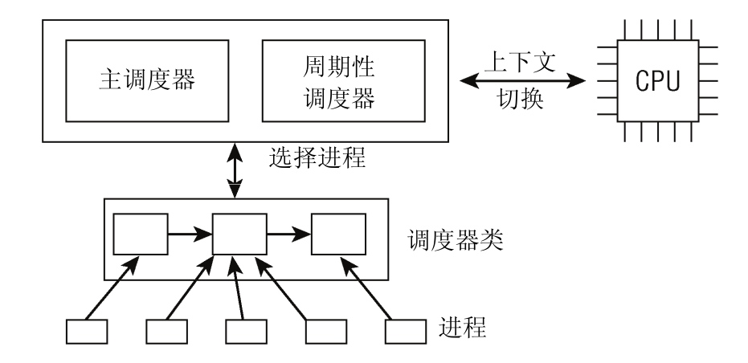
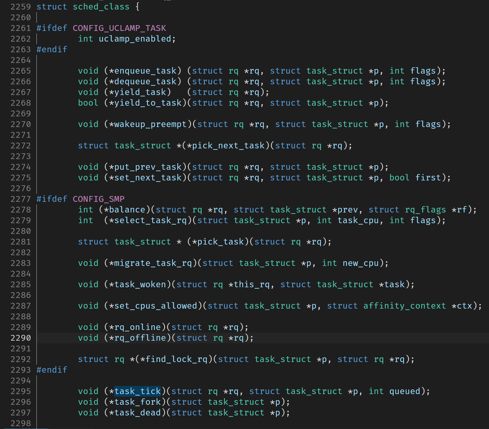
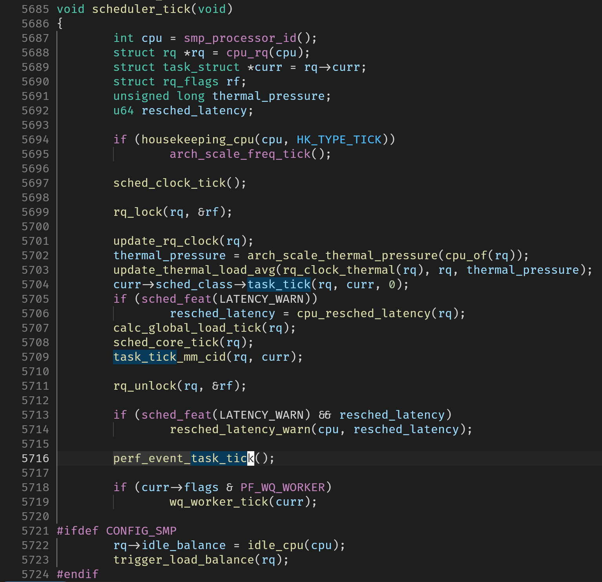
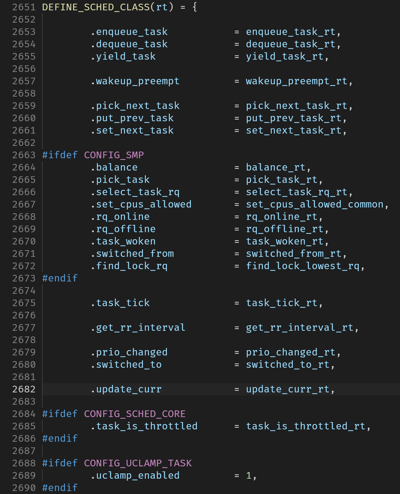
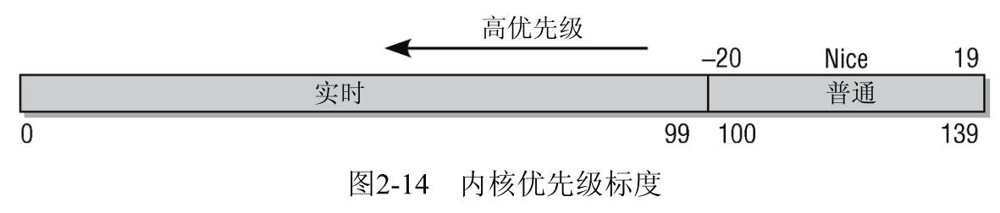

# 每个CPU的实时调度基本数据结构

相关内容的示意图摘自《深入Linux内核架构》

在Linux中遵循POSIX标准实现了两种实时调度算法：FIFO和RR。对于FIFO的使用需要小心，防止出现FIFO独占整个CPU的情况。

## 调度器基本框架



POSIX标准规定的调度算法的声明单位是线程，即假设系统有N个调度算法，那么N个线程最多有N种调度算法。

多种调度算法由一个调度类进行管理，如RR和FIFO都由实时调度类进行管理。该调度类实现内核`sched_class`结构体要求的所有函数指针的函数实现。

如下图所示即为`sched_class`的声明：


调度类使用了这种方式将实时调度和其他调度区别开来，核心调度器不关心调度类内部实现细节，仅使用`sched_class`中的函数指针调用对应的函数实现。



如上图所示，这是核心调度器中的一个tick（1ms）执行一次的处理函数，它中间调用了`curr->sched_class->task_tick(...)`。对于实时线程，这个函数是由实时调度类（`rt_sched_class`）提供的`task_tick_rt`。

`rt_sched_class`的定义如下：


## task_struct

```c
struct task_struct {
#ifdef CONFIG_THREAD_INFO_IN_TASK
    /*
     * For reasons of header soup (see current_thread_info()), this
     * must be the first element of task_struct.
     */
    struct thread_info      thread_info;
#endif
    unsigned int            __state;

    /* saved state for "spinlock sleepers" */
    unsigned int            saved_state;

    /*
     * This begins the randomizable portion of task_struct. Only
     * scheduling-critical items should be added above here.
     */
    randomized_struct_fields_start

    void                *stack;
    refcount_t          usage;
    /* Per task flags (PF_*), defined further below: */
    unsigned int            flags;
    unsigned int            ptrace;

#ifdef CONFIG_SMP
    int             on_cpu;
    struct __call_single_node   wake_entry;
    unsigned int            wakee_flips;
    unsigned long           wakee_flip_decay_ts;
    struct task_struct      *last_wakee;

    /*
     * recent_used_cpu is initially set as the last CPU used by a task
     * that wakes affine another task. Waker/wakee relationships can
     * push tasks around a CPU where each wakeup moves to the next one.
     * Tracking a recently used CPU allows a quick search for a recently
     * used CPU that may be idle.
     */
    int             recent_used_cpu;
    int             wake_cpu;
#endif
    int             on_rq;

    int             prio;
    int             static_prio;
    int             normal_prio;
    unsigned int            rt_priority;

    struct sched_entity     se;
    struct sched_rt_entity      rt;
    struct sched_dl_entity      dl;
    struct sched_dl_entity      *dl_server;
    const struct sched_class    *sched_class;
    ...
    pid_t               pid;
    pid_t               tgid;
    ...
};
```

这是进程调度的结构体，非常长（821行代码），它包含：

- 进程状态和执行信息（PID、优先级、父/子进程指针、待绝信号等）
- 已分配的虚拟内存信息
- 进程身份凭据（用户信息和权限等）
- 使用的程序二进制文件
- 进程处理的文件信息
- 进程间通信有关信息
- 用户定义的信号处理函数
- 调度类的信息（上述`sched_class`在task_struct中表现为一个`sched_class`指针）

等信息

> 注：task_struct同时用于线程和进程，不只是进程使用，故而调度器也以它为基本单位

调度优先级prio、static_prio、normal_prio以及rt_priority之间有着微妙的关系，如下图和下表所示：



| 进程类型/优先级                    | static_prio | normal_prio               | prio        |
| ---------------------------------- | ----------- | ------------------------- | ----------- |
| 非实时进程                         | static_prio | static_prio               | static_prio |
| prio暂时高至实时优先级的非实时进程 | static_prio | static_prio               | prio不变    |
| 实时进程                           | static_prio | MAX_RT_PRIO-1-rt_priority | prio不变    |

其中，`static_prio`是通过创建进程时的nice值计算得到的。

`__state`和`saved_state`可以表示进程运行的状态，运行状态可以有

- RUNNING（在就绪队列就算，不需要运行）
- INTERRUPTABLE
- UNINTERRUPTIBLE（二者均是睡眠状态）
- STOPPED
- ZOMBIE（僵尸进程是进程已退出却未被父进程调用join回收）
- DEAD

## rt_rq结构体

`rq`是内核设计的一种ready queue结构体

```c
struct rq {
    /* runqueue lock: */
    raw_spinlock_t      __lock;

    unsigned int        nr_running;
    ...
    struct cfs_rq       cfs;
    struct rt_rq        rt;
    struct dl_rq        dl;
    ...
};
```

```c
struct rt_rq {
    struct rt_prio_array    active;
    ...
};

struct rt_prio_array {
    DECLARE_BITMAP(bitmap, MAX_RT_PRIO+1); /* include 1 bit for delimiter */
    struct list_head queue[MAX_RT_PRIO];
};
```

`rq`中有一个rt_rq的结构体，它完全遵从POSIX规范，其中每个优先级都存储了一个链表，并使用位图存储了哪些优先级有进程（可以加速获取优先级最高的链表的进程）
