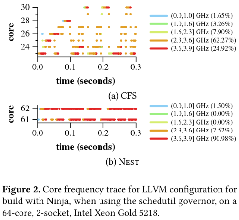
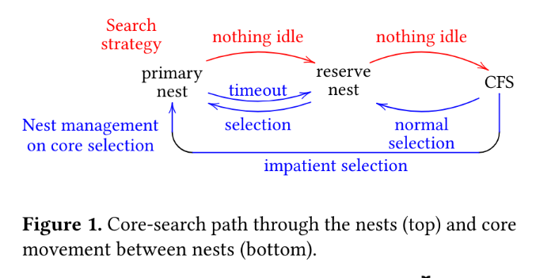

# scx_nest：NEST调度器的sched_ext实现

`scx_nest`是`sched_ext`官方示例中基于[NEST调度器论文](https://hal.inria.fr/hal-03612592/file/paper.pdf)（Julia Lawall 等人，EuroSys '22）实现的一个调度器。它演示了如何用一个BPF程序，把论文中“让任务尽量待在最近使用过的、频率较高的核上”这一思想落地。本文先介绍NEST调度器的设计，再逐段分析`scx_nest`的代码实现。

## NEST调度器简介

### 要解决的问题

通常情况下，一个调度器的实现可以分为时间域问题和空间域问题：

- 时间域问题：任务如何在一个队列中被排序，何时应该被调度执行的问题；
- 空间域问题：任务应该在何处运行，选核逻辑以及负载均衡。

NEST调度器的实现**不解决时间域问题**（这部分保持CFS的核心算法vruntime），而是**解决空间域问题**，具体来说是**选核逻辑问题**。NEST调度器修改了原本`fair`调度器中的选核时任务应该尽可能铺开打散到各个空闲核上的基本思路，而是尽可能利用上刚刚空闲的核，尽可能将任务约束在必要的有限核集合（primary nest）中执行。

Linux默认的CFS调度器在任务创建（fork）和唤醒（wakeup）时，倾向于把任务**分散**到整台机器上：

- 它会优先选择**最空闲**的核，哪怕这个核已经很久没被使用过；
- 它会跨socket搜索，导致任务被不必要的散布到多个socket上。

这种工作负载被打散到尽可能多的CPU的策略是否一定有利？

作者认为这种策略在低负载时不一定有利，这带来了两个副作用：

1. **性能损失**：长时间空闲的核处于较低的频率，把任务放上去会以一个较低的初始频率开始执行，拖慢性能。现代CPU支持turbo频率，但高频的获得需要「尽量少的活跃核」+「持续的活跃度」。
2. **能耗浪费**：任务被散布到多个socket，无法让某些socket完全进入低功耗状态。



> [!NOTE]
> 论文中用LLVM的CMake配置脚本做了个直观的case study：CFS在只有一两个任务并发时，仍把任务分散到了8个核上，这些核停留在较低的turbo档位；而NEST只用了2个核，且这2个核几乎全程保持最高频率。

> [!NOTE]
> 个人总结如下：假设当前计算机在给定时间内能提供的CPU计算时间为$t_{CPU}$，在相同时间内每一个任务需要的计算时间为$t_i$，当
> $$ t_{CPU} > \sum_i^{i \in Tasks}t_i $$
> 时，CFS的工作负载打散策略就会反而导致性能劣化。
> 因此，明确`scx_nest`的使用场景很重要：在核数众多的刀片服务器上，且服务器运行的任务不会完全跑满所有核的情况下适合使用。

### 设计原则

NEST围绕两条原则设计：

- **复用核心（reuse cores）**：把任务优先放在最近执行任务的空闲核上，而不是随便找一个空闲核；
- **保持核心温暖（keep cores warm）**：当一个核短暂空闲时，让idle进程自旋一小段时间，鼓励硬件维持较高的频率。

> [!IMPORTANT]
> `scx_nest`主要实现了“复用核心”的思想，并没有实现论文中的“保持核心温暖”。具体见后文“与论文实现的差异”。

### 实现方式

#### 定义 nest CPU 集合

NEST维护两个核的集合（nest），在放置任务时按优先级考虑：

- **primary nest**：当前正在使用、或最近刚被使用过、预期近期还会用到的核；
- **reserve nest**：之前在**primary nest**中、但近期没被使用的核，或者刚被CFS选中、尚未证明自己必要的核。

**reserve nest**的大小被限制为`R_max`个核。

#### 任务 fork/wakeup 时的选核逻辑



论文中给出了任务唤醒/创建时的核搜索顺序（图的上半部分）：

1. 先在 **primary nest** 中找空闲核（从任务之前执行的核或者fork时父线程的核开始搜索，优先同die）；
2. 找不到再去 **reserve nest** 中找空闲核（从某个固定核开始，防止任务选核过分分散，优先同die）；
3. 再找不到就**回退到CFS**。

搜索时**不考虑核的近期负载**，这与CFS相反——CFS会因为一个核“最近被用过”而跳过它，NEST正是要复用这些核。

特殊规则：

- **绑定（attached）**：为了减少任务在多个核间跳动，NEST为每个任务维护一个**大小为2的执行历史**（上一次、上上次执行的核）。如果任务连续两次在同一个核上执行，就认为它**绑定（attached）**到了这个核上。任务唤醒时，第一个尝试的就是它绑定的核（前提是该核在 **primary nest** 中且空闲）。

> [!NOTE]
> 原本CFS的wakeup选核逻辑不保证任务选核时选中的如果是非空闲核仍然存在其他空闲核可用；但在NEST中修改了这一逻辑，wakeup选核除了考虑当前die还扫描所有die的空闲核。

#### 维护 nest CPU 集合

核会在两个 nest 之间以及 nest 与外部之间迁移（图的下半部分）：

- **提升（promotion）**：从 **reserve nest** 选中的核 → 提升到 **primary nest**；从 CFS 选中的核 → 提升到 **reserve nest**（若已满`R_max`则丢弃，不进任何nest）；
- **压缩（compaction）**：**primary nest** 中长时间（`P_remove`个tick）没被使用的核 → 降级到 **reserve nest**（若reserve已满则直接丢弃）。此外，如果任务在一个核上终止使其空闲，该核立即从 **primary nest** 降级到 **reserve nest**。
- **快速提升（impatient）**：当 **primary nest** 的核数不足以支撑所有任务运行时，可能会有任务在 **primary nest** 中长期无法在上一次运行的核上执行，需要频繁在核间“弹跳”。如果任务连续`R_impatient`次发现自己上次的核被占用，就被标记为**impatient**。此时放置该任务会跳过primary nest，直接转向reserve nest乃至CFS，把选中的核直接加入primary nest以扩大其规模。

### 论文实验 & 结论

#### 超参数

论文选取的参数如下：

| 参数 | 含义 | 取值 |
| --- | --- | --- |
| `P_remove` | 空闲核从 **primary nest** 移除的延迟 | 2 tick（=8ms） |
| `R_max` | reserve nest最大核数 | 5 |
| `R_impatient` | 触发impatient的连续失败次数 | 2 |
| `S_max` | idle自旋最大时长 | 2 tick |

#### 结论

在多个多核benchmark上，对“任务数少于核数”的负载，NEST能带来 **10%~2×** 的性能提升，同时最多可 **减少20%** 的CPU能耗；对高度并行（任务数≥核数）的负载，NEST与CFS性能相当。

## scx_nest 的实现

`scx_nest`和其他 scx 调度器一样，由两部分组成：

- `scx_nest.bpf.c`：加载进内核的BPF调度器（核心逻辑）；
- `scx_nest.c`：用户态loader与统计输出界面；

> [!NOTE]
> 除了这两个文件还有`scx_nest.h`和`scx_nest_stats_table.h`：用于统计项枚举定义。

### 参数与数据结构

```c
const volatile u64 p_remove_ns = 2 * NSEC_PER_MSEC;   // P_remove
const volatile u64 r_max = 5;                          // R_max
const volatile u64 r_impatient = 2;                    // R_impatient
const volatile u64 slice_ns;
const volatile bool find_fully_idle = false;
```

这些参数与论文表1一一对应（`p_remove_ns`默认2ms，比论文的8ms小，因为BPF定时器以ns为粒度）。

两个巢用kptr存放的cpumask表示：

```c
private(NESTS) struct bpf_cpumask __kptr *primary_cpumask;
private(NESTS) struct bpf_cpumask __kptr *reserve_cpumask;
```

`private(NESTS)`是scx对私有全局变量的封装（用于多调度器场景的命名空间隔离）。

每个任务的上下文：

```c
struct task_ctx {
	struct bpf_cpumask __kptr *tmp_mask;   // 计算primary/reserve交集时的临时掩码
	u32 prev_misses;                        // 连续「上次核被占」的次数
	s32 attached_core;                      // 任务附着的核（论文中「历史大小2」的产物）
	s32 prev_cpu;                           // 上次执行的核
};
```

每个CPU的上下文（用于compaction定时器）：

```c
struct pcpu_ctx {
	struct bpf_timer timer;         // 压缩该核用的定时器
	bool scheduled_compaction;      // 该核是否已被安排压缩
};
```

### nest_select_cpu：核搜索路径

`nest_select_cpu`是Nest思想的核心，其搜索顺序几乎照搬论文图1：

```c
tctx->prev_cpu = prev_cpu;
bpf_cpumask_and(p_mask, p->cpus_ptr, cast_mask(primary));

/* 1. 先尝试附着核（必须在primary中且空闲） */
if (bpf_cpumask_test_cpu(tctx->attached_core, cast_mask(p_mask)) &&
    scx_bpf_test_and_clear_cpu_idle(tctx->attached_core)) {
	cpu = tctx->attached_core;
	goto migrate_primary;
}

/* 2. 再尝试上次的核（在primary中且空闲） */
if (prev_cpu != tctx->attached_core &&
    bpf_cpumask_test_cpu(prev_cpu, cast_mask(p_mask)) &&
    scx_bpf_test_and_clear_cpu_idle(prev_cpu)) {
	cpu = prev_cpu;
	goto migrate_primary;
}

/* 3. 若开启find_fully_idle，找primary中完全空闲的核 */
/* 4. 找primary中任意空闲核（不管hyperthread） */
/* 5. 若达到r_impatient，标记impatient */
/* 6. 在reserve nest中找空闲核（同样先fully idle后any idle） */
/* 7. 在任务cpumask里找任意空闲核（回退） */
```

几个关键点：

- **`scx_bpf_test_and_clear_cpu_idle`**：原子地测试并清除一个核的空闲标记，相当于论文中「用CAS保证一个核上最多放一个任务」的优化，防止并发唤醒争抢同一个核。
- **impatient逻辑**：`++tctx->prev_misses >= r_impatient`时置`direct_to_primary = true`并清零计数。这会让后面回退路径选中的核**直接进primary**，从而扩大 **primary nest**。
- **回退路径**（第7步）是最冷的路径，选中一个「不在任何巢里」的核后，还要再做一次检查以处理并发竞争，然后要么进primary（direct_to_primary或已在reserve），要么调`try_make_core_reserved`放入reserve。

`try_make_core_reserved`负责向reserve nest加核，并维护核数不超过`r_max`：

```c
tmp_nr_reserved = nr_reserved;
if (tmp_nr_reserved < r_max) {
	__sync_fetch_and_add(&nr_reserved, 1);
	bpf_cpumask_set_cpu(cpu, reserved);
	...
} else {
	bpf_cpumask_clear_cpu(cpu, reserved);
	stat_inc(NEST_STAT(RESERVED_AT_CAPACITY));
}
```

`migrate_primary`/`promote_to_primary`标签后的代码负责：把选中的核放进primary，若它还在reserve里则从reserve移除（`nr_reserved`减1），并且**取消该核已安排的压缩定时器**（因为核又被启用了）：

```c
bpf_cpumask_set_cpu(cpu, primary);
if (bpf_cpumask_test_cpu(cpu, cast_mask(reserve))) {
	__sync_sub_and_fetch(&nr_reserved, 1);
	bpf_cpumask_clear_cpu(cpu, reserve);
}
```

最后更新附着关系并直接把任务分派到该核的`SCX_DSQ_LOCAL`：

```c
update_attached(tctx, prev_cpu, cpu);
scx_bpf_dsq_insert(p, SCX_DSQ_LOCAL, slice_ns, 0);
return cpu;
```

`update_attached`实现了论文中根据前两次选核记录的attached判定：

```c
static void update_attached(struct task_ctx *tctx, s32 prev_cpu, s32 new_cpu)
{
	if (tctx->prev_cpu == new_cpu)
		tctx->attached_core = new_cpu;
	tctx->prev_cpu = prev_cpu;
}
```

只有当「上一次执行」的核等于「这次选择」的核时，才把任务附着到该核。

### nest_enqueue：全局加权vtime

`select_cpu`是放置策略，`enqueue`则是公平策略。Nest自己用一个全局vtime调度器，让任务按虚拟时间排序进入共享队列：

```c
void BPF_STRUCT_OPS(nest_enqueue, struct task_struct *p, u64 enq_flags)
{
	u64 vtime = p->scx.dsq_vtime;
	...
	/* 限制空闲任务累积的预算最多为一个slice */
	if (vtime_before(vtime, vtime_now - slice_ns))
		vtime = vtime_now - slice_ns;

	scx_bpf_dsq_insert_vtime(p, FALLBACK_DSQ_ID, slice_ns, vtime, enq_flags);
}
```

所有任务（无论被select_cpu放到哪个核）最终都进入同一个全局DSQ `FALLBACK_DSQ_ID`，由`scx_bpf_dsq_insert_vtime`按vtime排序。这跟CFS的vruntime思想一致。

### nest_running / nest_stopping：vtime推进

与`scx_simple`类似，Nest维护全局`vtime_now`，并在任务停止时按权重反比累加其vtime：

```c
void BPF_STRUCT_OPS(nest_running, struct task_struct *p)
{
	if (vtime_before(vtime_now, p->scx.dsq_vtime))
		vtime_now = p->scx.dsq_vtime;
}

void BPF_STRUCT_OPS(nest_stopping, struct task_struct *p, bool runnable)
{
	p->scx.dsq_vtime += (slice_ns - p->scx.slice) * 100 / p->scx.weight;
}
```

### nest_dispatch：消费与压缩

`dispatch`先把全局队列里的任务搬到本地DSQ执行：

```c
if (!scx_bpf_dsq_move_to_local(FALLBACK_DSQ_ID)) {
	in_primary = bpf_cpumask_test_cpu(cpu, cast_mask(primary));

	/* 若前一个任务仍在队列且本核在primary中，让它继续跑 */
	if (prev && (prev->scx.flags & SCX_TASK_QUEUED) && in_primary) {
		scx_bpf_dsq_insert(prev, SCX_DSQ_LOCAL, slice_ns, 0);
		return;
	}
	...
}
```

当全局队列为空、没有任务可跑时，就进入**压缩逻辑**——这正是论文中“核不再被使用就从 **primary nest** 移除”的落地。这里有两条路径：

1. **急切压缩**：如果前一个任务是“死”的（`TASK_DEAD`，这里的“死”是说任务不能再被当作正常RUNNABLE TASK调度），立即把该核从primary移除，降入reserve（通过`try_make_core_reserved`）。注意代码有意跳过第一个核，以保证至少留一个核在 **primary nest**：

```c
if ((prev && prev->__state == TASK_DEAD) &&
	(cpu != bpf_cpumask_first(cast_mask(primary)))) {
		stat_inc(NEST_STAT(EAGERLY_COMPACTED));
		bpf_cpumask_clear_cpu(cpu, primary);
		try_make_core_reserved(cpu, reserve, false);
}
```

2. **定时压缩**：否则设置一个`p_remove_ns`的定时器，若这段时间内核仍未被使用，就由`compact_primary_core`回调把它降入reserve：

```c
if (...) {
		//...
} else {
		pcpu_ctx->scheduled_compaction = true;
		bpf_timer_start(&pcpu_ctx->timer, p_remove_ns, BPF_F_TIMER_CPU_PIN);
		stat_inc(NEST_STAT(SCHEDULED_COMPACTION));
}
```

`compact_primary_core`定时器回调（在`nest_select_cpu`里如果核又被启用，则会`bpf_timer_cancel`取消这个回调）：

```c
static int compact_primary_core(void *map, int *key, struct bpf_timer *timer)
{
	bpf_cpumask_clear_cpu(cpu, primary);
	try_make_core_reserved(cpu, reserve, false);
	...
}
```

### nest_init_task / nest_init：初始化

`nest_init_task`为新任务分配`task_ctx`和临时cpumask，并初始化`attached_core`、`prev_cpu`为-1：

```c
tctx = bpf_task_storage_get(&task_ctx_stor, p, 0, BPF_LOCAL_STORAGE_GET_F_CREATE);
cpumask = bpf_cpumask_create();
cpumask = bpf_kptr_xchg(&tctx->tmp_mask, cpumask);
tctx->attached_core = -1;
tctx->prev_cpu = -1;
```

`nest_init`创建fallback DSQ、初始化primary/reserve两个cpumask，并为每个CPU初始化压缩定时器：

```c
err = scx_bpf_create_dsq(FALLBACK_DSQ_ID, NUMA_NO_NODE);
...
bpf_for(cpu, 0, nr_cpus) {
	struct pcpu_ctx *ctx = bpf_map_lookup_elem(&pcpu_ctxs, &key);
	ctx->scheduled_compaction = false;
	bpf_timer_init(&ctx->timer, &pcpu_ctxs, CLOCK_BOOTTIME);
	bpf_timer_set_callback(&ctx->timer, compact_primary_core);
}
```

此外还初始化了一个统计定时器`stats_timerfn`，周期性地把primary/reserve/other/idle掩码写入bss供用户态打印（见`print_active_nests`）。

### SCX_OPS_DEFINE

最终注册的ops：

```c
SCX_OPS_DEFINE(nest_ops,
	.select_cpu  = (void *)nest_select_cpu,
	.enqueue     = (void *)nest_enqueue,
	.dispatch    = (void *)nest_dispatch,
	.running     = (void *)nest_running,
	.stopping    = (void *)nest_stopping,
	.init_task   = (void *)nest_init_task,
	.enable      = (void *)nest_enable,
	.init        = (void *)nest_init,
	.exit        = (void *)nest_exit,
	.name        = "nest");
```

## 与论文实现的差异

论文的实现是**修改CFS**（Linux v5.9，约500行、6个文件），而`scx_nest`是**sched_ext BPF调度器**，两者在以下方面不同：

| 方面 | 论文（改CFS） | scx_nest |
| --- | --- | --- |
| 实现方式 | 直接改内核`fair.c`/`core.c` | BPF程序 + 用户态loader |
| 公平性策略 | CFS的vruntime | 自己实现的全局加权vtime |
| 核频率感知 | 无（靠idle自旋`S_max`保持温暖） | 无，只做复用 |
| 工作守恒 | 扩展唤醒搜索到所有die | 回退到任务cpumask的`scx_bpf_pick_idle_cpu` |

一个值得注意的区别：论文强调的"keep cores warm"（idle自旋）在`scx_nest`中**没有实现**。`scx_nest`只实现了"reuse cores"的部分——把任务集中到最近使用的核上，从而让这些核更可能维持高频。这也是`sched_ext`这类可插拔调度器的一个优势：核的选择逻辑可以独立地在BPF里实现，而频率管理仍交给内核的power governor（如schedutil）。

## 参考文档

- [OS Scheduling with Nest: Keeping Tasks Close Together on Warm Cores](https://hal.inria.fr/hal-03612592/file/paper.pdf)（EuroSys '22）
- [scx_nest源码](https://github.com/sched-ext/scx/tree/main/scheds/c/scx_nest.bpf.c)
- [sched_ext overview](https://github.com/sched-ext/scx/blob/main/OVERVIEW.md)
