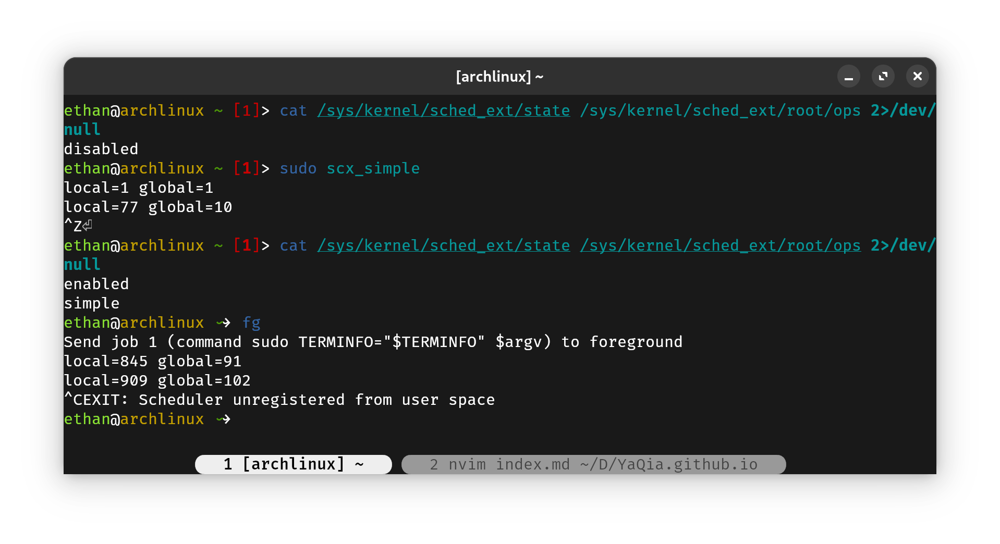
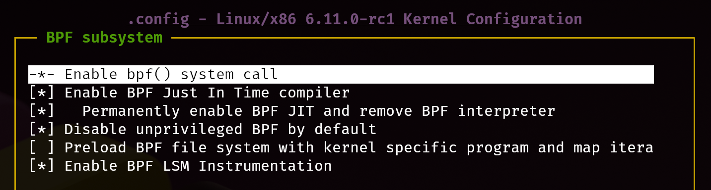
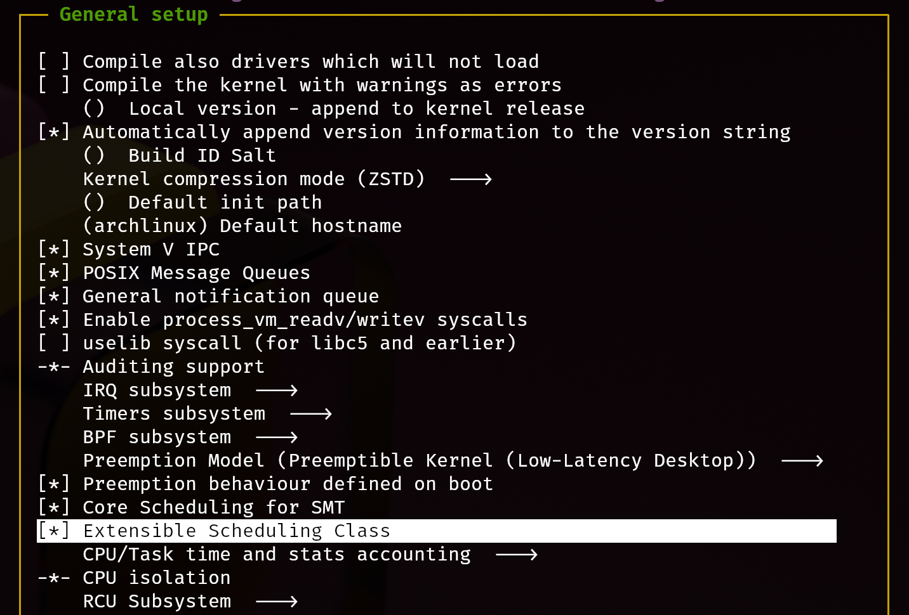
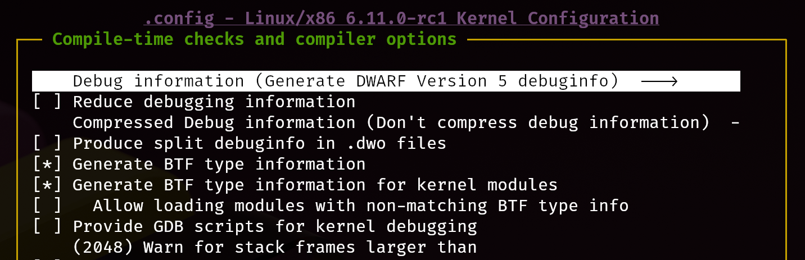
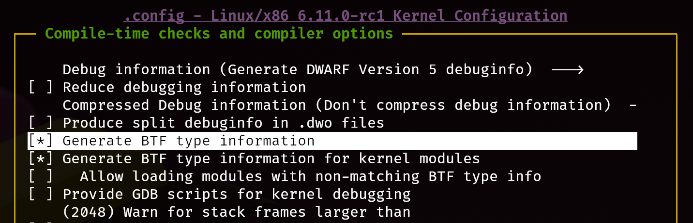

# `sched_ext`简介

长久以来Linux内核都考虑实现一个通用的调度器以应对各种场景，只有少量对外暴露的微调调度器的参数，使得应用端可以更接近理想性能，但`sched_ext`打破了这种传统。

`sched_ext`是即将加入Linux 6.12的一种新的调度策略，它支持用户使用BPF程序书写自定义的调度器，完成无须关机的、热插拔式的调度策略更新。

它的使用甚是简单，直接启动对应调度器的用户端应用程序，即可开始使用这种调度策略，而随时可以用Ctrl+C结束这种调度策略。

```bash
scx_simple  # 启动simple调度器
```



> 注：有的朋友可能会顾虑如果调度器崩溃该怎么办。实际上若调度器崩溃、或走向未预期行为，`sched_ext`会主动卸载该调度算法，并恢复默认的调度策略（`sched_ext`在没有装载时默认与`sched_fair`相同）

## Arch Linux安装带sched_ext的Linux内核

CachyOS作为Arch Linux的一个衍生发行版，积极地为x86_64架构的Linux做性能优化，为此甚至不惜为主线Linux打尚未合并的patch。在CachyOS编译的内核中，就已经启用sched_ext的功能。因此只需要安装该系统发布的内核即可。

详细安装过程可以参考[scx维护者提供的安装方法](https://github.com/sched-ext/scx/blob/main/INSTALL.md#arch-linux)

> 注意⚠️：当前`sched_ext`的部分功能尚未成熟，其中`scx_rustland`在笔者实验中出现过崩溃的情况。不建议在个人电脑上直接使用，建议使用虚拟机实验。

添加镜像和相关签名：

```bash
sudo pacman-key --recv-keys F3B607488DB35A47 --keyserver keyserver.ubuntu.com
sudo pacman-key --lsign-key F3B607488DB35A47
sudo pacman -U 'https://mirror.cachyos.org/repo/x86_64/cachyos/cachyos-keyring-20240331-1-any.pkg.tar.zst' 'https://mirror.cachyos.org/repo/x86_64/cachyos/cachyos-mirrorlist-18-1-any.pkg.tar.zst'
```

编辑`/etc/pacman.conf`，加入如下内容：

```bash
# cachyos repos
[cachyos]
Include = /etc/pacman.d/cachyos-mirrorlist
```

安装CachyOS编译的带`sched_ext`的内核：

```bash
sudo pacman -Sy meson cargo bpf pahole
sudo pacman -Sy cachyos/linux-sched-ext cachyos/linux-sched-ext-headers cachyos/scx-scheds
```

其他发行版也可以在scx官方找到[安装教程](https://github.com/sched-ext/scx/tree/main?tab=readme-ov-file#install-instructions-by-distro)

## 编译带`sched_ext`的Linux内核

### 获取`sched_ext`仓库

由于当前Linux主线并没有并入该特性，故需要下载特殊的Linux kernel仓库，并开启相关编译选项。

下载sched_ext仓库地址：[sched_ext.git](https://git.kernel.org/pub/scm/linux/kernel/git/tj/sched_ext.git/)

注意若要`git clone --depth 1`加速下载，则需要使用`--branch`指定正确的分支，否则将默认得到`master`分支的内容。即：

```bash
git clone --depth 1 --branch for-6.12 git://git.kernel.org/pub/scm/linux/kernel/git/tj/sched_ext.git
```

### 编译选项选择

如果你事先安装好了带`sched_ext`的内核，则直接将内核配置生成一份.config即可：

```bash
zcat /proc/config.gz > .config      # 仅对Arch系发行版
```

> 注：这一步不同发行版有所不同，请参考对应发行版的编译选项配置存放位置

> 另注：编译时可以尽量将驱动的编译取消，这样可以节省大量编译时间

如果你的发行版没有办法直接安装带`sched_ext`的内核，请按下面的方法开启编译选项：

1. General setup -> BPF subsystem -> Enable bpf() system call
   
2. General setup -> Extensible Scheduling Class
   
3. Kernel Hacking -> Scheduler Debugging
   
4. Kernel Hacking -> Compile-time checks and compiler options -> Debug information (Generate DWARF Version 5 debuginfo)
   
5. Kernel Hacking -> Generate BTF type information
   

完成配置后开始编译即可：

```fish
make CC=clang -j(nproc) # fish写法，在bash是-j$(nproc)
```

> Tips: 关于如何让Linux内核编译时生成`compile_commands.json`，请看我的[这一篇博客](../blogs/building_linux_kernel.md)

除了编译内核外，还需要编译`tools/sched_ext`的代码，这里面的代码才是`sched_ext`自定义调度器逻辑实现的部分

```fish
make CC=clang LLVM=1 -j(nproc)
```

> 注：有`No such file or directory`的情况请安装相应的程序

> 另注：可以使用bear -- make的方式来生成编辑器需要的`compile_commands.json`

完成编译后即可测试自定义的调度器的执行情况：

```bash
sudo ./build/bin/scx_simple
```

## 撰写简单的`sched_ext`调度器

为了能够自己手写一个`sched_ext`调度器，我们需要参考`scx_simple`的范例程序。

### 调度周期（Scheduling Cycle）

DSQ是`sched_ext`使用的内部调度队列数据结构，它的全称是`dispatch queue`，在系统内部有每个CPU独享的`SCX_DSQ_LOCAL`和所有CPU共享的`SCX_DSQ_GLOBAL`。

同时DSQ也可以被用户自定义创建，这样就可以形成用户DSQ和内核DSQ的双层结构。它可以通过`scx_bpf_create_dsq`完成创建。

> 注：默认情况下，`SCX_DSQ_GLOBAL`和`SCX_DSQ_LOCAL`都只支持FIFO（即只支持`scx_bpf_dispatch`调用），而自定义DSQ则支持优先级排序（即支持`scx_bpf_dispatch_vtime`调用）。

下面简要说明唤醒任务是如何调度和执行的。

1. 当任务唤醒时，`ops.select_cpu()` 是调用的第一个操作。这有两个目的：一、CPU较优选型提示。其次，如果空闲，则唤醒所选CPU。

   `ops.select_cpu()`选择的CPU 是一个优化提示，而不是绑定。实际的决定是在调度的最后一步做出的。
   但是，如果`ops.select_cpu()`返回的CPU与任务最终运行的CPU匹配，则性能会略有提升。

   选择CPU的副作用之一是将其从空闲状态唤醒。当`select_cpu`返回的CPU是一个空闲CPU时，则该CPU会被系统唤醒。
   虽然BPF调度程序可以使用`scx_bpf_kick_cpu()`帮助程序唤醒任何cpu，但明智地使用`ops.select_cpu()`可以更简单、更高效。

   通过调用`scx_bpf_dispatch()`，可以立即将任务从`ops.select_cpu()`分派到DSQ。如果任务从`ops.select_cpu()`调度到SCX_DSQ_LOCAL，则它将被调度到`ops.select_cpu()`的返回值对应的CPU的本地DSQ。
   此外，直接从`ops.select_cpu()`调度将导致跳过`ops.enqueue()`回调。

   > 注：调度程序核心将忽略无效的CPU选择。例如，如果它超出了任务允许的`cpumask`范围。

2. 一旦选择了目标CPU，就会调用`ops.enqueue()`（除非任务是直接从`ops.select_cpu()`分派的）。`ops.enqueue()`可以做出以下决定之一：

   - 通过分别使用`SCX_DSQ_GLOBAL`或`SCX_DSQ_LOCAL`调用`scx_bpf_dispatch()`，立即将任务分派到全局或本地 DSQ。
   - 通过使用小于 2^63 的DSQ ID调用`scx_bpf_dispatch()`立即将任务分派到自定义DSQ。
   - 在BPF程序中对任务进行排队（利用BPF程序自定义的数据结构）。

3. 当CPU准备好调度时，它首先查看其本地DSQ (local DSQ)。如果为空，则它会查看全局DSQ (global DSQ)。如果仍然没有要运行的任务，则会调用`ops.dispatch()`，它可以使用以下两个函数来填充本地DSQ。

   - `scx_bpf_dispatch()`将任务分派到 DSQ。可以使用任何目标DSQ - `SCX_DSQ_LOCAL`、`SCX_DSQ_LOCAL_ON | cpu`、`SCX_DSQ_GLOBAL`或自定义DSQ。虽然目前**无法在持有BPF锁的情况下调用**`scx_bpf_dispatch()`，但这一问题正在开发中并将受到支持。`scx_bpf_dispatch()`安排调度而不是立即执行被调度任务。最多可以有`ops.dispatch_max_batch`待处理任务。
   - `scx_bpf_consume()`将任务从指定的非本地DSQ转移到调度DSQ。**持有任何BPF锁时无法调用此函数**。`scx_bpf_consume()`在尝试使用指定的DSQ之前刷新待调度的任务。

4. `ops.dispatch()`返回后，如果本地DSQ中有任务，则CPU运行第一个任务。如果为空，则执行以下步骤：

   - 尝试消耗全局DSQ。如果成功，则运行该任务。
   - 如果ops.dispatch()已分派任何任务，请重试＃3。
   - 如果前一个被调度任务是SCX任务并且仍然可以运行，则继续执行它（详情请参阅`SCX_OPS_ENQ_LAST`）。
   - 进入空闲状态。

调用流程如下流程图所示，其中紫色代表内核接管部分，蓝色代表要实现的代码，绿色表示可以调用的bpf_helper函数。

<!--  -->
<div align="center">
   
</div>

### BPF程序

在写C语言版本的BPF程序的时候，通常需要两部分的代码：

1. BPF字节码对应的BPF程序，需要加载进入内核空间运行；
2. 用户空间的BPF loader，依赖于libbpf。

> 注：若使用bcc tools的Python或bpftrace语言的方式写BPF程序，则不需要将代码手动分解为两部分，一份代码即可完成加载和编译运行的操作。
> 但我们需要书写内核调度器代码，所以更推荐以C语言/rust语言的方式实现。

> 另注：可以参考[Linux核心设计：BPF](https://hackmd.io/@RinHizakura/S1DGq8ebw)来了解BPF在Linux中的编写方法。

在我们要阅读的`scx_simple`的代码中，`scx_simple.bpf.c`是要加载到内核的BPF字节码对应的程序；`scx_simple.c`是加载器和前端的终端输出界面。

知道流程后再来看`scx_simple.bpf.c`的实现：

```c
SCX_OPS_DEFINE(simple_ops,
	      .select_cpu		= (void *)simple_select_cpu,
	      .enqueue			= (void *)simple_enqueue,
	      .dispatch 		= (void *)simple_dispatch,
	      .running			= (void *)simple_running,
	      .stopping	   = (void *)simple_stopping,
	      .enable			= (void *)simple_enable,
	      .init		    	= (void *)simple_init,
	      .exit		    	= (void *)simple_exit,
	      .name		    	= "simple");
```
在`sched_ext`的实现中，需要使用各种宏，`SCX_OPS_DEFINE`是其中用来注册实现的回调函数的宏。

默认情况下，所有的回调实现都可以缺省，只需要`name`项即可。（都有默认实现）

```c
s32 BPF_STRUCT_OPS_SLEEPABLE(simple_init)
{
	return scx_bpf_create_dsq(SHARED_DSQ, -1);
}

void BPF_STRUCT_OPS(simple_exit, struct scx_exit_info *ei)
{
	UEI_RECORD(uei, ei);
}
```
初始化的时候创建了自定义的DSQ队列（一个共享队列），传入的第二个参数-1表示其numa节点设置为-1（即`NUMA_NO_NODE`）。

```c
// Enable BPF scheduling for a task
// enable is paired with disable
void BPF_STRUCT_OPS(simple_enable, struct task_struct *p)
{
	p->scx.dsq_vtime = vtime_now;
}
```
`enable`的时候将虚拟时间设置为`vtime_now`，它通过下面的方法记录了当前最新的在运行的任务的vtime：
```c
void BPF_STRUCT_OPS(simple_running, struct task_struct *p)
{
	if (fifo_sched)
		return;

	/*
	* Global vtime always progresses forward as tasks start executing. The
	* test and update can be performed concurrently from multiple CPUs and
	* thus racy. Any error should be contained and temporary. Let's just
	* live with it.
	*/
	if (vtime_before(vtime_now, p->scx.dsq_vtime))
		vtime_now = p->scx.dsq_vtime;
}

void BPF_STRUCT_OPS(simple_stopping, struct task_struct *p, bool runnable)
{
	if (fifo_sched)
		return;

	/*
	* Scale the execution time by the inverse of the weight and charge.
	*
	* Note that the default yield implementation yields by setting
	* @p->scx.slice to zero and the following would treat the yielding task
	* as if it has consumed all its slice. If this penalizes yielding tasks
	* too much, determine the execution time by taking explicit timestamps
	* instead of depending on @p->scx.slice.
	*/
	p->scx.dsq_vtime += (SCX_SLICE_DFL - p->scx.slice) * 100 / p->scx.weight;
}
```

## 参考文档

[Linux 核心設計: Scheduler(7): sched_ext](https://hackmd.io/@RinHizakura/r1uSVAWwp#)

[sched_ext (2) : 分析排程器程式碼](https://hackmd.io/@vax-r/sched_ext_2?utm_source=preview-mode&utm_medium=rec)

[sched_ext overview](https://github.com/sched-ext/scx/blob/main/OVERVIEW.md)

[sched_ext机制研究](https://rqdmap.top/posts/scx/)

[BPF map类型官方文档](https://ebpf-docs.dylanreimerink.nl/linux/concepts/maps/)

[BPF map的实现机制](https://www.ebpf.top/post/map_internal/)
