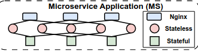
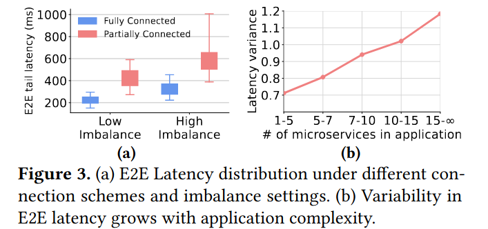
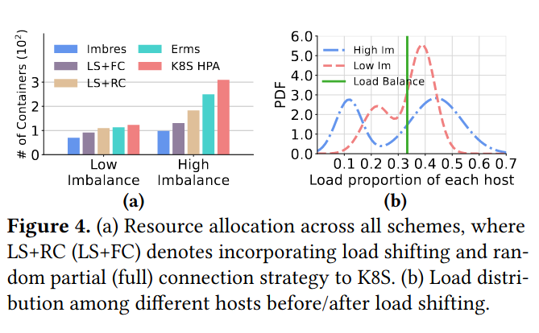
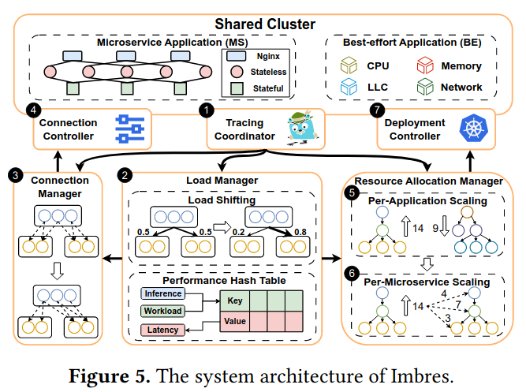
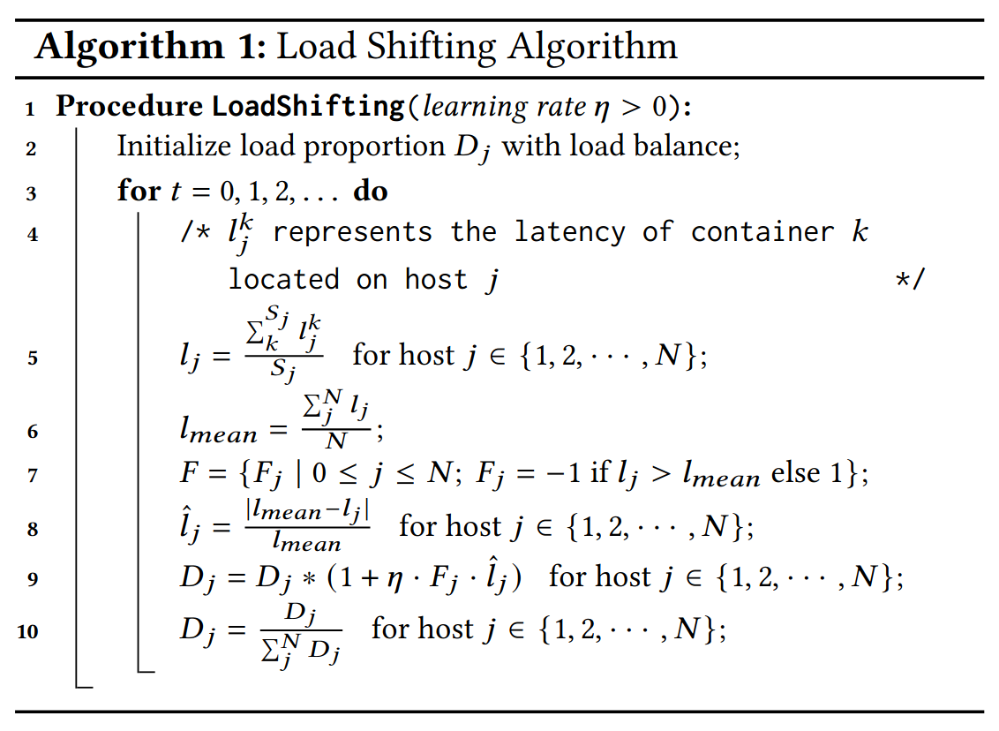
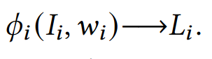

# Embracing Imbalance: Dynamic Load Shifting among Microservice Containers in Shared Clusters

## 这个工作相比以往工作的不同有哪些？它要解决的挑战是什么？

以往有大量工作提出了类似的思想：负载均衡达不到最优性能，利用负载的不均衡完成对单体应用的性能优化。

这背后一般是系统针对某种应用调优，不考虑系统整体负载平均，且不主动控制其他应用运行参数或资源使用量，仅对单体应用本身的运行参数、资源使用量调优。

但目前缺少**微服务场景下**利用负载不均衡实现性能优化的工作。现有的微服务扩缩容机制（k8s的HPA）只是在微服务整体上资源利用率高后弹性扩容，不考虑单个容器的资源利用率高低的影响，这就会让低干扰的容器资源容量被浪费。

> [!TIP]
> 微服务场景下，一个应用以一到多个微服务构成，一个微服务由零到多个容器构成。
> 容器间通过RPC连接完成数据传输、唤醒调用等操作。
>
> 在FaaS实现的微服务下，一个容器就用于运行一个函数。

作者提出，在微服务中可以使用负载转移(load shifting)的方法利用负载不均衡来提高性能。
但这在微服务场景下该方法存在挑战：

1. 在微服务内，单个微服务创建了成百上千个容器，每一个容器会受到不同程度干扰。这使得找到均衡性能的最优负载转移的**搜索空间庞大**。
   > 简单来说，负载转移让各个容器根据其受到的干扰程度调整负载，单一个微服务来看就有几百到几千个容器要调，更不用说一个应用可能包括几十上百个微服务，这就使得针对每个容器粒度的负载转移的计算变得复杂。
2. 在微服务间，上下游微服务的容器只能建立部分RPC持久连接，这会进一步让性能不均衡。这些连接需要在负载转移的同时被管理。
   > 例如，当上游微服务容器被严重干扰，下游微服务容器也被严重干扰，部分连接选中这两个容器就会严重拖慢其端到端延迟。

> [!TIP]
> 实际上也可以让上下游微服务完全建立RPC连接，这样能尽可能找到全局最优的负载转移，但是实际使用时都不会建立全连接网络，因为全连接所需要的数据缓冲区和连接状态维护都是消耗内存的。
>
> 假设上游容器有1000个，下游容器有1000个，则全连接的网络需要$1000\times 1000=1000000$个连接，光是一层的连接就消耗了过多的系统资源。

## 背景

### 统一调度(Unified Scheduling)

统一调度是业界主流的策略，在同一个集群中将延迟敏感应用(Latancy Critical)（例如微服务）和批处理(Best Effort)应用混部以提升整体资源利用率。

### 动态资源干扰

从Alibaba的真实微服务数据得出：高度动态的资源干扰导致了在同一个微服务的各个容器性能不均衡。

> [!TIP]
> 这里说的性能不均衡应该包括了两种不均衡：
>
> 1. 时间不均衡：在不同时刻单个容器的性能不同；
> 2. 空间不均衡：同一时刻下不同容器的性能不同。

作者量化了每个微服务中各个容器的延迟方差和干扰不均衡（用各主机间资源利用率方差来表征）的相关性系数，超过50%的微服务中这两个变量的[斯皮尔曼相关系数](https://zh.wikipedia.org/wiki/%E6%96%AF%E7%9A%AE%E5%B0%94%E6%9B%BC%E7%AD%89%E7%BA%A7%E7%9B%B8%E5%85%B3%E7%B3%BB%E6%95%B0)都≥0.5。
这说明干扰不平衡和延迟方差有一定程度的相关性。

### 端到端尾延迟变化程度

作者认为，共享环境中由于在单个微服务中各个容器的性能不平衡，所以整个微服务的端到端延迟会存在显著波动。

作者设计了一个实验，在微服务系统中运行DeathStarBench和一个BE应用（iBench）生成10%~60%的CPU资源、内存带宽和网络带宽利用率变化。
将主机以资源利用率最大最小值差异区分为大于30%差值的高不平衡主机和小于等于30%差值的低不平衡主机。

计算各个主机的所有应用端到端尾延迟情况以及延迟方差随应用中微服务数量的变化：

## 动机

### 通过负载转移可以将预分配的资源量降低

保持BE应用运行条件不变，
以k8s现有的HPA(Horizontal Pod Autoscaling)方案和SOTA的Erms方案作为基准，对比让P95端到端尾延迟仍保持在SLA内需要的预留资源数量（即容器数量）。

> [!TIP]
> 容器数量就能反映预分配资源量，虽然容器本身不一定会占用那些资源（例如进程睡眠时不会占用CPU资源），但k8s会为容器预分配这些资源。
>
> 例如：每个容器0.1CPU、200MiB内存。

在作者实现的**Imb**alance-aware **re**source **s**caling framework (Imbres)上，对于高干扰不平衡的场景下每个主机的负载的双峰分隔得更开了，说明Imbres在高干扰不平衡时实现了高负载分布不均，
负载分布不均有助于容器间的性能平衡，并显著降低各微服务的尾部延迟，从而为提升资源利用率创造机会。

## Imbres框架

### 三层框架 & 七个组件

三层框架有：

1. 独立的负载控制优化（对应图中2）
2. 智能连接管理机制（对应图中3、4）
3. 全局资源分配管理（对应图中5、6、7）

七个组件有：

1. 监控协调获取：每个微服务中单个容器的延迟；每个应用端到端延迟
   > 该组件收集Prometheus和Jaeger的监控数据
2. 负载管理：主要执行负载迁移，周期性基于监控数据调优每个微服务内各个容器的负载分布。并维护一个性能哈希表（传递给3和5、6）。
3. 连接管理：它基于2提供的负载分布和**从性能哈希表中得到的上游容器性能**决定容器间的部分连接关系（连接哪些部分）和连接的负载份额。
4. 连接控制：接过连接管理对连接的调整，应用到相关容器中，执行实际的连接建立和负载控制
5. 每个应用级别的资源分配管理：
6. 每个微服务级别的资源分配管理：

### 负载控制优化

#### 使用高效的在线梯度学习算法解决复杂的优化问题

针对每个主机按比例分配负载，通过主机上的平均延迟$l_j$计算其负载。

> 缺点：这个方法需要一定时间收敛

#### 构建性能哈希表

通过某个微服务的平均负载$w_i$（即QPS）、所有物理机的平均资源使用量$I_i$（CPU、内存带宽、网络带宽）这两个键，得到该微服务中所有容器的尾延迟平均值。

> [!TIP]
> 通过这个公式可以推算某个主机上某个容器的工作负载下、主机资源使用量下，该容器中的尾延迟

### 连接管理机制

## 启发

1. 对于不是对完整系统管理的场景，负载均衡不是最优策略，通过负载不均衡达到LC应用执行速度均衡会更好
2. 性能哈希表通过采样一些典型关键数据得出尾延迟
